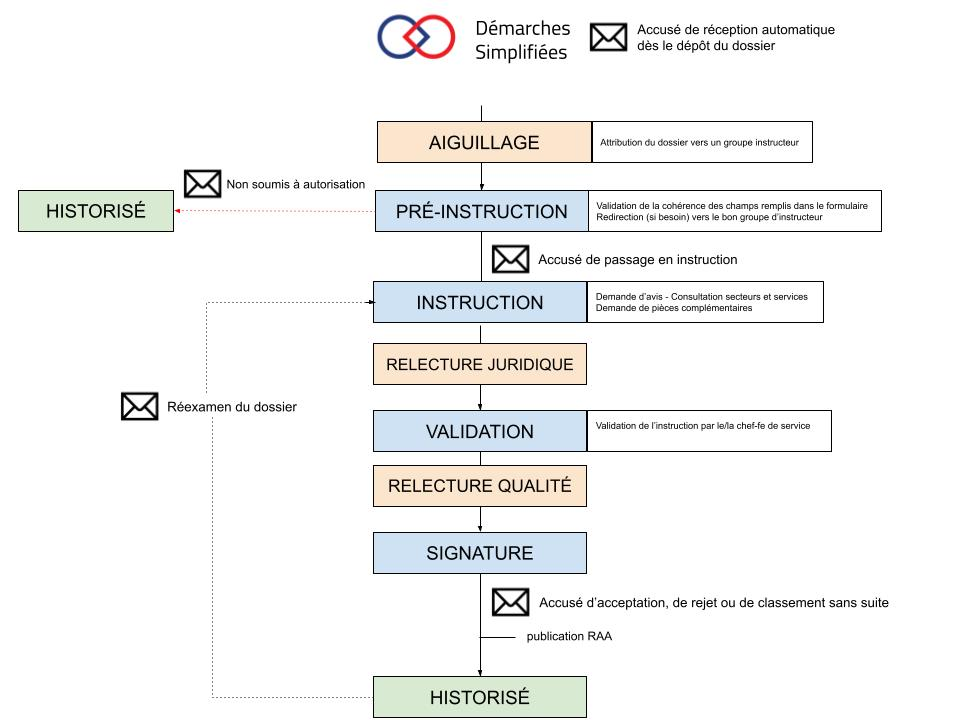
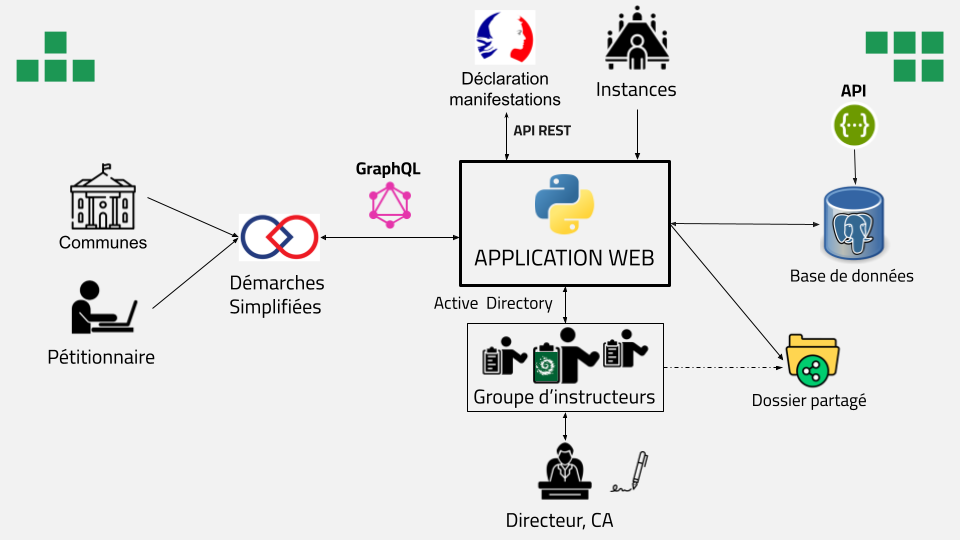

# Projet Autorisations

Application Django visant à simplifier le **suivi**, **l'instruction** et **l’archivage** des demandes d'autorisation faites au **Parc national de La Réunion**, notamment via la plateforme [Démarches Simplifiées](https://www.demarches-simplifiees.fr/).

---

## 🔁 Logigramme de l'instruction des dossiers

Le processus d’instruction suit une séquence définie, du dépôt initial jusqu’à l’archivage :



---

## 🏗️ Architecture de l'application

Le projet s’organise autour de plusieurs modules internes (synchronisation, normalisation, messagerie, suivi), et interagit avec des outils tiers comme Démarches Simplifiées (via GraphQL) ou Active Directory.



---

## 📁 Structure du projet

Voici une vue simplifiée de l’arborescence du projet :

```plaintext
autorisations/
├── src/
│   ├── authent/               # Authentification Active Directory
│   ├── autorisations/         # App Django principale (models, fichiers de configuration..) 
│   ├── BDD/                   # Interactions avec Postgres (ORM et Swagger)
│   ├── DS/                    # Intégration API Démarches Simplifiées (GraphQL)
│   ├── instruction/           # Fonctionnalités liées à l’instruction des dossiers
│   ├── logs/                  # Les différents fichiers de log
│   ├── synchronisation/       # Traitements de normalisation et synchronisation entre Postgres et Démarches Simplifiées
│   ├── tests/                 # Tests unitaires

```


## 📬 Contact
En cours de développement par le Parc national de La Réunion
Responsable technique : CALU Louis (louis.calu@reunion-parcnational.fr)
