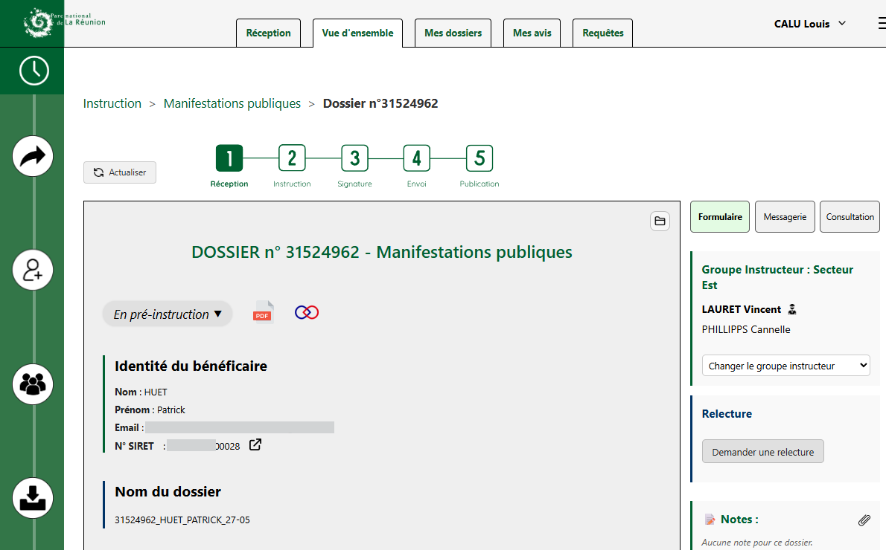
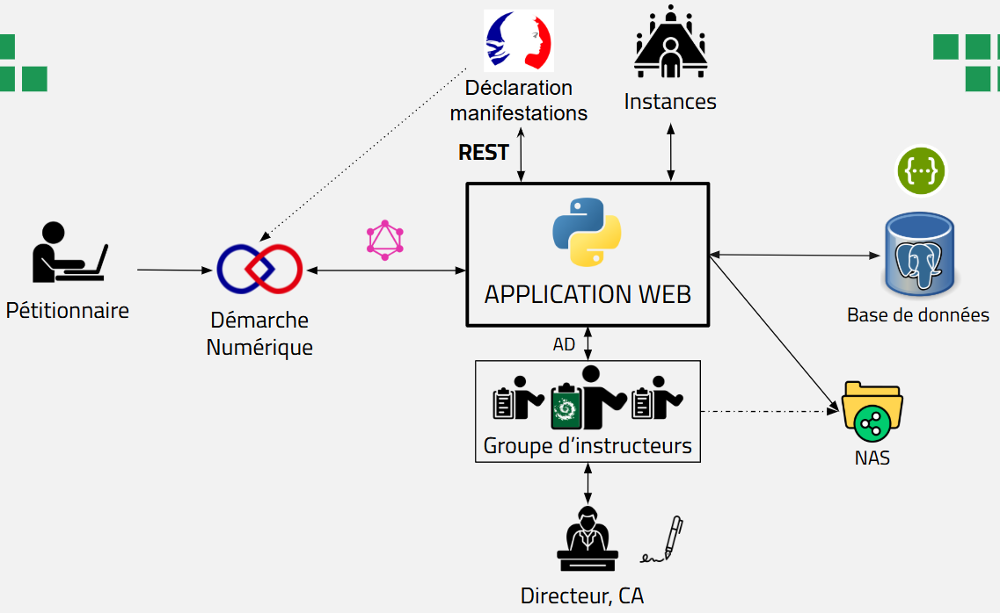

# Projet Autorisations

Application Django visant à simplifier le **suivi**, **l'instruction** et **l’archivage** des demandes d'autorisation faites au **Parc national de La Réunion**, notamment via les plateformes [Démarche Numérique](https://demarche.numerique.gouv.fr/) et [Déclaration Manifestations](https://declaration-manifestations.gouv.fr/).

---

## Aperçu de l'application



---

## Architecture

Le projet s’organise autour de plusieurs modules internes (synchronisation, normalisation, messagerie, suivi), et interagit avec des outils tiers.



---

## L'instruction des dossiers

Le processus d’instruction suit une séquence définie, du dépôt initial jusqu’à l’archivage :


---

## 📁 Structure du projet

Soit DM = Déclaration Manifestations et DN = Démarche Numérique.  
Voici une vue simplifiée de l’arborescence du projet :

```plaintext
autorisations/
├── src/
│   ├── authent/                     # Authentification Active Directory
│   ├── autorisations/               # App Django principale (models, fichiers de configuration..) 
│   ├── BDD/                         # Interactions avec Postgres (ORM et Swagger)
│   ├── DS/                          # Intégration API DN (GraphQL)
│   ├── declaration_manifestations/  # Intégration API DM (Rest)
│   ├── instruction/                 # Fonctionnalités liées à l’instruction des dossiers
│   ├── logs/                        # Les différents fichiers de log
│   ├── synchronisation/             # Traitements de normalisation et synchronisation entre Postgres, DN et DM
│   ├── tests/                       # Tests unitaires

```


## 📬 Contact
Développement par le Parc national de La Réunion\
Responsable technique : CALU Louis (louis.calu@reunion-parcnational.fr)
