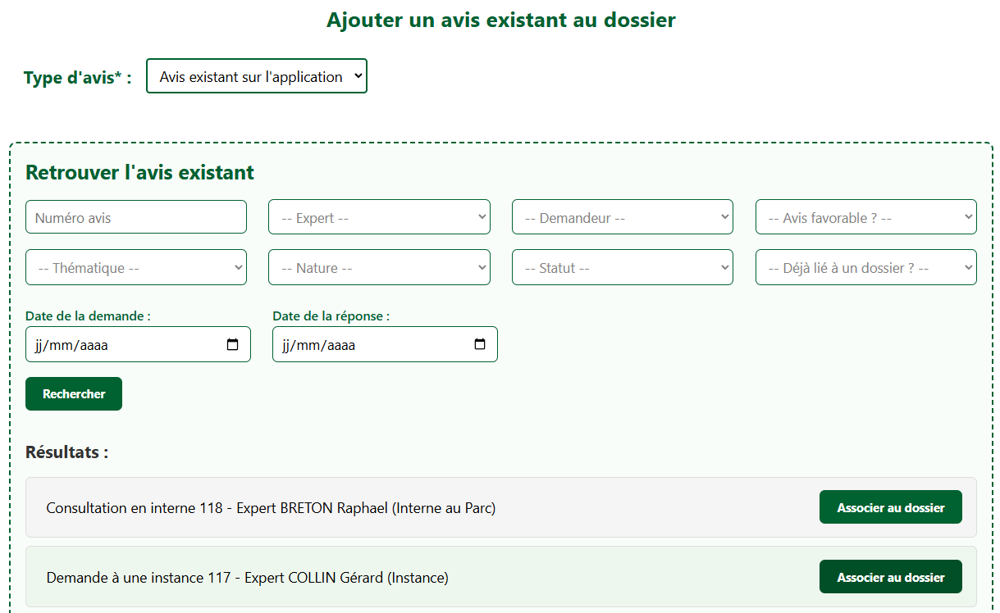

# Ajouter un avis existant

## Avis existant sur l'application

---

<figure style="text-align: center;">
  
  <figcaption><em>Figure 1 — Lier un avis existant à un dossier </em></figcaption>
</figure>

---

Si un un avis lié à un autre dossier ou avis générique concerne notre dossier, on peut alors l'associer. Pour cela, il faut d'abord retrouver l'avis en question à l'aide de la **recherche filtrée**.

Une fois trouvé, il suffit de cliquer sur « Associer au dossier ». **L'avis apparaîtra désormais dans l'onglet « Consultation »** de notre dossier. 

---

## Avis hors application

On laisse la possibilité d'ajouter un avis qui aurait été émis en dehors de l'application.

Pour ce faire, vous devez dérouler le formulaire :

- **Nature de l'avis** : *Consultation en interne* ou *Demande à une instance*

- **Instructeur.rice à l'origine de la demande** : Choisir dans le menu déroulant

- **Thématique de l'avis** : Choisir dans le menu déroulant

- **Expert interne/externe** : Choisir dans le menu déroulant

- **Expert.e sollicité.e via** : Courrier papier, Mail, Téléphone, Autre

- **Réponse de l'avis** : Favorable ou Défavorable

- **Date de la demande d'avis** : Date à laquelle la demande d'avis à été émise

- **Date de la réponse de l'expert.e** : Date à laquelle l'expert.e a répondu

- **Note** : Facultatif. Visible uniquement par les autres collègues

- **Pièce(s) jointe(s) liée(s) à l'avis** : Facultatif. *Pensez à donner des noms intuitifs à vos fichiers*

---