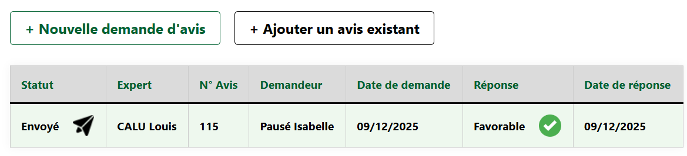
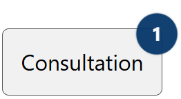

# Les consultations

L’onglet **Consultation** permet de visualiser et de suivre l’ensemble des **avis associés à un dossier**.

---

<figure style="text-align: center;">
  
  <figcaption><em>Figure 1 — Interface « Consultation » </em></figcaption>
</figure>

---

**Une ligne correspond à un avis**. Un clic sur une ligne du tableau permet d’ouvrir **l’avis correspondant**.

**Statut** : indique l’état d’avancement de l’avis. Les valeurs possibles sont :

  - *Brouillon*
  - *À valider*
  - *À envoyer*
  - *Envoyé*

**Réponse** : correspond à la position exprimée par l’expert. Les valeurs possibles sont :

  - *Favorable*
  - *Favorable sous réserve*
  - *Défavorable*

---

<figure style="text-align: center;">
  
  <figcaption><em>Figure 2 — Pastille de notification </em></figcaption>
</figure>

L’onglet **Consultation** peut afficher une **pastille numérotée** comme ci-dessus.
Cette notification indique le **nombre d’avis pour lesquels une réponse ou un message de l’expert n’a pas encore été consulté.**

Pour plus de détails sur le fonctionnement des notifications, consulter la page [Notifications](../notifications.md).

---