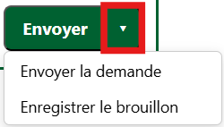

# Nouvelle demande d'avis

## Les champs à renseigner dans le formulaire de création d'une demande d'avis

🔴 : Pas concerné par ce champ   
🟠 : Champ facultatif   
🟢 : Champ obligatoire   

---

| Nom du champ | Description | En interne | À une instance |
|:-----:|--------|--------|--------|
| Nature de l'avis | *Consultation en interne* ou *Demande à une instance* | 🟢 | 🟢 |
| Thématique de l'avis | Exemple : Chambre d'hôtes | 🟢 | 🟢 |
| Note | Note libre visible uniquement parles autres instructeurs.rices | 🟠 | 🟠 |
| Mode de contact | *Via l'application* (par défaut), *Courrier papier*, *Téléphone* ou *Mail* | 🟢 | 🟢 |
| Joindre la demande d'avis (Word) | Exemple : Le projet d'avis du CS | 🟠 | 🟢 |
| Joindre le projet d'acte (Word, PDF) | Exemple : Le projet d'arrêté | 🔴 | 🟢 |
| Joindre le rapport d'avis du CS (PDF) | Uniquement pour le Conseil Scientifique | 🔴 | 🟠 |
| Autres pièce(s) jointe(s) liée(s) à l'avis | Si nécessaire | 🟠 | 🟠 |
| Choix de l'expert externe | Pour les demandes aux instances | 🔴 | 🟢 |
| Choix de l'expert interne | Pour les consultations en interne | 🟢 | 🔴 |
| Formulation de l'avis | Message envoyé à l'expert.e avec la demande d'avis | 🟢 | 🟢 |

---

## Le statut « Brouillon »

Vous n'êtes **pas obligé de remplir le formulaire de création de demande d'avis et de l'envoyer instantanément**, vous pouvez enregistrer votre formulaire en cours de remplissage.

<figure style="text-align: center;">
  
  <figcaption><em>Figure 1 — Enregistrer ou envoyer la demande </em></figcaption>
</figure>

---

Votre avis apparait donc dans l'onglet consultation au **statut « Brouillon »**. À tout moment vous pouvez retourner sur votre formulaire de création d'avis et le finaliser.

Ce statut « Brouillon » est également utile si vous souhaitez faire valider votre demande d'avis à un.e collègue avant de l'envoyer. 

---