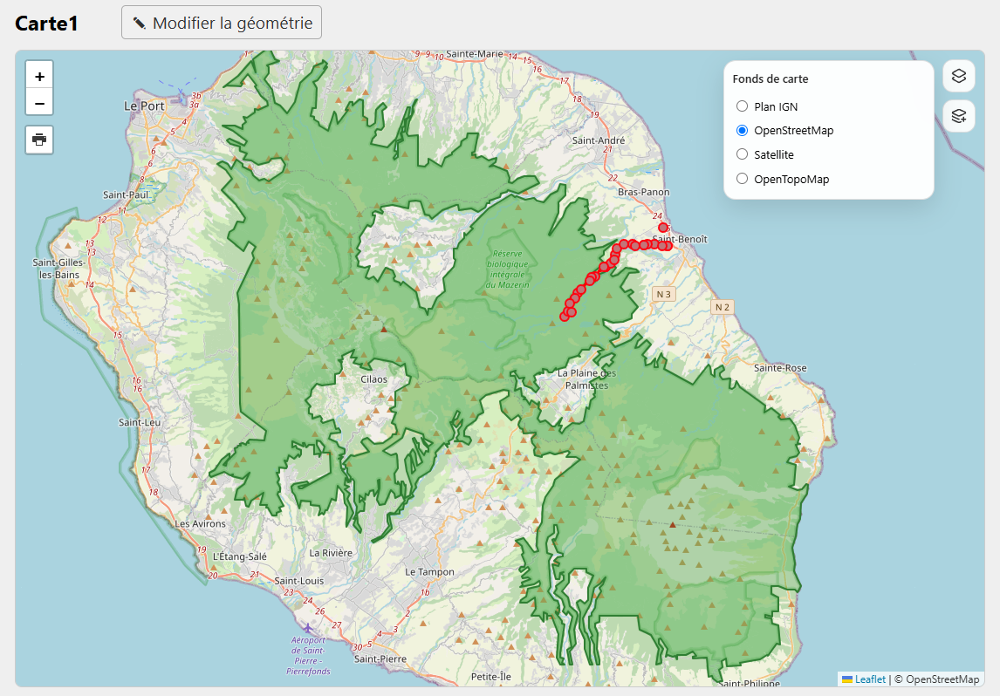
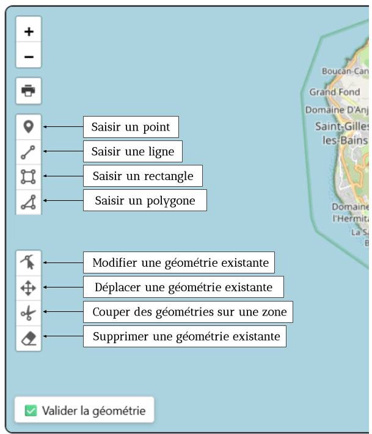

# Le module cartographique

## Depuis l'onglet formulaire

---

<figure style="text-align: center;">
  
  <figcaption><em>Figure 1 — La cartographie depuis l'onglet formulaire </em></figcaption>
</figure>

---

La **géométrie saisie par le pétitionnaire** est affichée sur la carte :

- elle apparaît **en rouge**.
- elle peut prendre la forme de points, de lignes et/ou de polygones.

---

Plusieurs outils permettent de naviguer facilement dans la carte :

- **Zoom avant / arrière** : À l’aide de la **molette de la souris** ou via les **boutons situés à gauche** de la carte.

- **Déplacement** : Cliquer-glisser pour se déplacer dans la carte.

- **Impression** : Un bouton permet de générer une **impression PDF** de la carte.

---

L’interface permet :

- d’**afficher ou masquer des couches cartographiques** (Cœur de Parc, Aire d'adhésion, etc.).
- de **changer le fond de carte** (IGN, OpenStreetMap, Satellite, etc.).

Si vous souhaitez ajouter de nouvelles couches ou proposer d’autres fonds de carte, rapprochez-vous du **support**.

---

**Modifier ou saisir une géométrie** :

- Si certaines géométries contiennent des erreurs ou vous semble incomplètes, vous pouvez les corriger/nettoyer grâce au bouton « Modifier la géométrie », qui vous redirige vers l'interface d'édition.

- Dans certain formulaire, on laisse la possibilité au pétitonnaire de ne pas remplir le module cartographique au profit d'une pièce jointe (schémas, photos, données géospatiales etc.). Dans ce cas, un bouton « Saisir la géométrie » apparaît et c'est à l'instructeur.rice de renseigner la géométrie. 

## L'interface d'édition

---

<figure style="text-align: center;">
  
  <figcaption><em>Figure 2 — Les fonctionnalités d'édition </em></figcaption>
</figure>

---

Si vous avez fait des modifications, **n'oubliez pas de « Valider la géométrie »**. Si vous retournez sur le formulaire, vous verrez désormais votre géométrie modifiée.

Si suite à des modifications de la géométrie initiale, **vous souhaitez remmetre la main sur la géométrie du pétitionnaire**, vous pouvez retrouver cette géométrie au format geojson dans le dossier */Carto* du dossier.

---