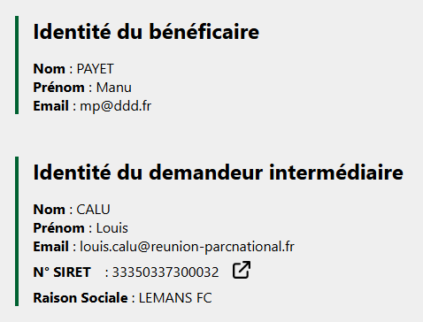
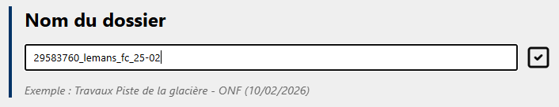

# Les champs du formulaire

## L'identité du demandeur

<figure style="text-align: center;">
  
  <figcaption><em>Figure 1 — L'identité du demandeur</em></figcaption>
</figure>

Dans la partie supérieure du formulaire, vous trouverez un bloc **Identité du bénéficiaire** ainsi que, le cas échéant, un bloc **Identité du demandeur intermédiaire**.

Ces sections permettent d’identifier votre interlocuteur et de préciser si la personne qui effectue la demande est le bénéficiaire ou un demandeur intermédiaire.

Dans le cas d’une personne morale, un lien vers l’annuaire de l’INSEE est disponible à droite du numéro SIRET afin de consulter les informations de l’organisation.

---

## Changer le nom du dossier

<figure style="text-align: center;">
  
  <figcaption><em>Figure 2 — Changer le nom du dossier </em></figcaption>
</figure>

Par défaut, le nom attribué à un dossier est généré automatiquement selon le format : 
```{NUMERO_DOSSIER}_{DEMANDEUR}_{DATE DE DÉPOT}```.

Dans certains cas, ce nom peut être peu explicite, notamment lorsque vous consultez des tableaux contenant de nombreux dossiers.

La fonctionnalité « Changer le nom » permet donc de modifier l’intitulé du dossier afin de l**e rendre plus facilement identifiable dans les différentes interfaces de l’application**. Cette modification est uniquement visuelle et n’a **aucun impact sur le traitement administratif du dossier**.

---

## Les champs ­« classiques »

Dans les autres sections du formulaire, vous trouverez différents types de champs :

- Les champs textuels : ils peuvent contenir différents types d’informations (dates, réponses oui/non, adresses, descriptions, numéros, choix simples ou multiples, etc.).
- Les pièces jointes : ces documents peuvent être téléchargés ou consultés directement dans le navigateur en cliquant sur le titre du fichier.
- Les champs cartographiques : ils permettent de visualiser ou de saisir des informations géographiques. Pour plus de détails, consultez la page dédiée : [Carto](carto.md)

