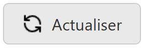
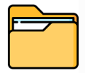
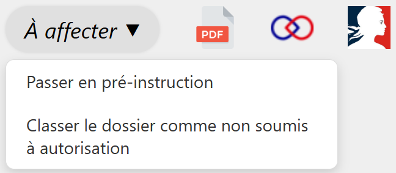

# L'entête du formulaire

## Actualiser un dossier

 

  <figure style="margin: 0; text-align: center; flex: 0 0 auto;">
    
    <figcaption><em>Figure 1 — Actualiser un dossier</em></figcaption>
  </figure>

  

    

      Ce bouton permet de synchroniser un dossier avec Démarche Numérique. Par exemple, si vous attendez rapidement des modifications de la part d’un pétitionnaire sur un dossier, vous pouvez actualiser uniquement ce dossier, sans avoir à relancer une synchronisation générale.
    

  

---

## Copier le chemin d'accès du dossier

 

  <figure style="margin: 0; text-align: center; flex: 0 0 auto;">
    
    <figcaption><em>Figure 2 — Copier le chemin</em></figcaption>
  </figure>

  

    
À chaque dossier est associé un emplacement physique, comme expliqué <a href="../stockage.html#structure-interne-dun-dossier">ici</a>. 
    Pour gagner du temps vous pouvez cliquer sur ce bouton qui copiera le chemin d'accès du dossier en question.  
     Exemple : \\x-wing\autoprod_data\Travaux\2026\Aire_adhesion\29141059_DREAL_03-02\  

  

---

## Fonctionnalités en haut du formulaire

 
<figure style="text-align: center;">
  
  <figcaption><em>Figure 3 — Les fonctionnalités en haut du formulaire </em></figcaption>
</figure>

---

- **Les changements d'étapes**

*À chaque étape, si vous êtes autorisé, vous pouvez déplier un menu déroulant et passer à l'étape suivante.*

 

- **Le résumé PDF du dossier**

*Démarche Numérique propose un résumé PDF complet du dossier.*
*Ce document est téléchargeable en cliquant sur l’icône PDF.*

*Ce résumé contient notamment :*

- *L’identité du demandeur*
- *le formulaire rempli par le demandeur*
- *les échanges entre le pétitionnaire et le service instructeur*

 

- **Le lien vers Démarche Numérique**

*En cliquant sur l’icône Démarche Numérique, vous accédez directement à la page du dossier sur la plateforme, à condition d’être connecté.*

 

- **Le lien vers Déclaration Manifestations**

*En cliquant sur l’icône Déclaration Manifestations, vous accédez directement à la page du dossier sur la plateforme, à condition d’être connecté.*

---