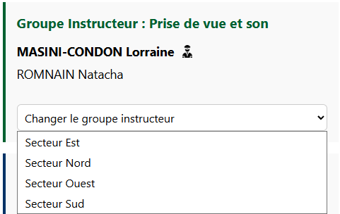
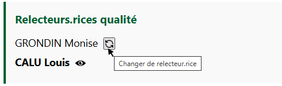
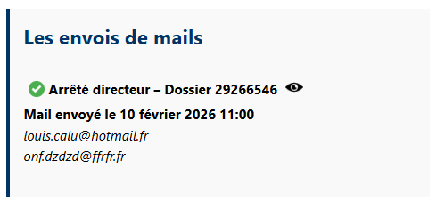
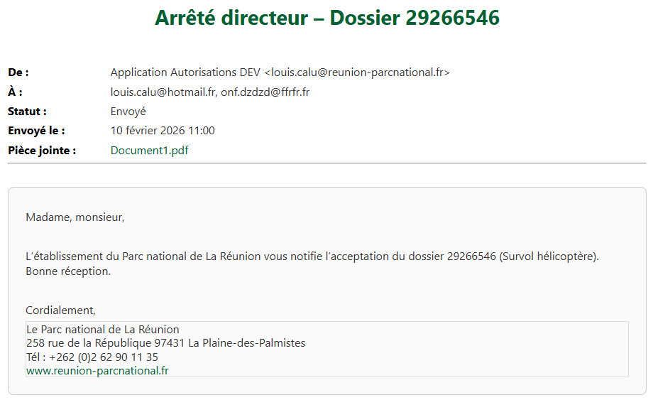
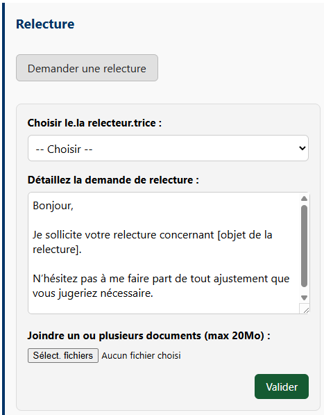
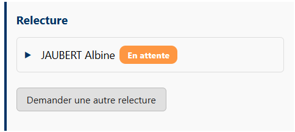
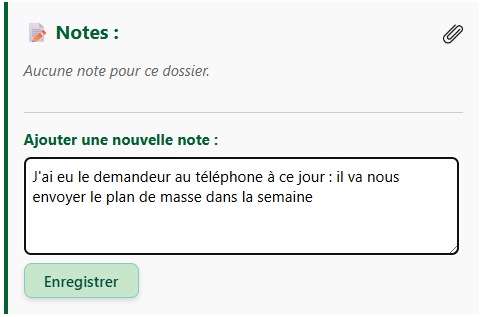

# Les sections à droite du formulaire

## Le Groupe Instructeur

Chaque dossier est associé à un groupe instructeur, lui même composé d'instructeur-rices.

<figure style="text-align: center;">
  
  <figcaption><em>Figure 1 — Le Groupe Instructeur</em></figcaption>
</figure>

Dans l’exemple ci-dessus, on remarque que Lorraine est l’instructrice affectée au dossier. Elle appartient au groupe instructeur « Prise de vue et son ».
Natacha appartient également à ce groupe instructeur, mais **elle n’est pas affectée au dossier : son nom n’apparaît pas en gras et l’icône située à droite de son nom n’est pas affichée.**

Il est toutefois possible que le dossier doive être traité par un autre groupe, par exemple le « Secteur Nord ». Dans ce cas, il faut modifier le groupe instructeur « Prise de vue et son » pour sélectionner « Secteur Nord ».

Une fois ce changement effectué, il ne faut pas oublier d’affecter au dossier un instructeur appartenant à ce nouveau groupe.

Pour cela, il suffit de survoler le nom de l’instructeur ou de l’instructrice, puis de cliquer sur l’icône qui apparaît à droite lors du passage de la souris.

---

## Les rôles

Vous pouvez, à certains moments de l'instruction d'un dossier, aperçevoir sur la droite, des boîtes de « Rôle » avec des personnes associées.

On distingue par exemple :

- Validant.e.s
- Relecteurs.rices qualité
- Intermédiaire pour la signature
- Chargé.e d'envoyer l'acte signé
- Chargé.e de publier l'acte au RAA

 

<figure style="text-align: center;">
  
  <figcaption><em>Figure 2 — Exemple : Relecteurs.rices qualité </em></figcaption>
</figure>

**Ces sections apparaissent à des moments précis du processus d’instruction.**

Dans l’exemple ci-dessus, il s’agit de la section « Relecteurs·rices qualité ». Cette section n’apparaît que lorsque le dossier est à l’étape de relecture qualité.

Elle permet d’identifier rapidement la personne en charge de cette relecture, ici Louis.

Si vous souhaitez changer de relecteur·rice, il suffit de survoler le nom d’un autre agent, puis de cliquer sur l’icône de changement qui apparaît à droite.
Dans l’exemple ci-dessus, cette icône est visible au survol du nom GRONDIN Monise.

**C'est le même principe pour les autres sections (Validant.e.s, Intermédiaire pour la signature ...)**

---

## Les envois de mails

Toujours dans ce pannel à droite du formulaire, vous pouvez aperçevoir, **si l'acte a déjà été envoyé au demandeur**, la section « Les envois de mails ».

<figure style="text-align: center;">
  
  <figcaption><em>Figure 3 — Les envois de mails </em></figcaption>
</figure>

Dans cette section, vous pouvez consulter les courriels envoyés — ou non — afin d’informer les différents contacts, en parallèle de l’envoi de l’acte au demandeur.

Cette section apparaît uniquement si l’instructeur·rice, au moment d’envoyer l’acte au demandeur, a choisi de le partager par courriel avec d’autres personnes (internes ou externes).

 

| Icône | Signification | Icône | Signification |
|:-----:|--------|:-----:|--------|
|  | Email bien envoyé |  | Email en attente d'envoi |
|  | Erreur - email non envoyé |

---

Si, comme dans l’exemple ci-dessus, le courriel a bien été envoyé, vous pouvez le visualiser dans le navigateur en cliquant sur l’icône « œil » située à droite :

 

<figure style="text-align: center;">
  
  <figcaption><em>Figure 4 — Visualiser le mail envoyé </em></figcaption>
</figure>

---

## Relecture

Dans le cadre de l'instruction d'un dossier, **vous avez la possibilité de solliciter des collègues pour effectuer des relectures** sur des documents, le formulaire etc..

<figure style="text-align: center;">
  
  <figcaption><em>Figure 5 — Faire une demande de relecture </em></figcaption>
</figure>

---

À votre message, vous pouvez joindre une ou plusieurs pièces jointes.
**Chaque pièce jointe ne doit pas dépasser 20 Mo**.

Une fois la demande de relecture envoyée, elle passe au statut « En attente ». Ce statut reste actif tant que la personne sollicitée n’a pas effectué la relecture.

<figure style="text-align: center;">
  
  <figcaption><em>Figure 6 — Relecture en attente </em></figcaption>
</figure>

---

**Une demande de relecture n’est pas bloquante dans le processus d’instruction** : vous pouvez continuer à faire avancer les différentes étapes du dossier en attendant la réponse à votre demande.

---

## Les notes

Enfin, tout en bas du panneau situé à droite du formulaire, vous trouverez **une section « Notes » :**

<figure style="text-align: center;">
  
  <figcaption><em>Figure 7 — La section « Notes » </em></figcaption>
</figure>

Cette section vous permet de **partager des informations avec vos collègues** participant, de près ou de loin, à l’instruction du dossier.

*Exemple : informations recueillies auprès du demandeur par téléphone, dossier incomplet, points de vigilance particuliers, etc.*

Dans cette section, vous pouvez également joindre des documents en cliquant sur l’icône en forme de trombone. Les pièces jointes ne doivent pas dépasser 20 Mo.

