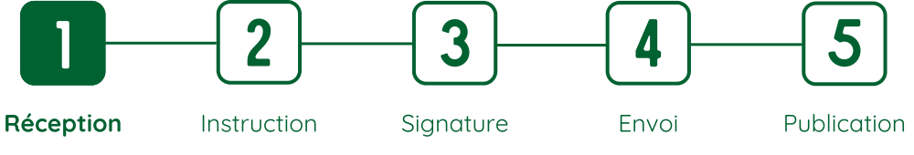
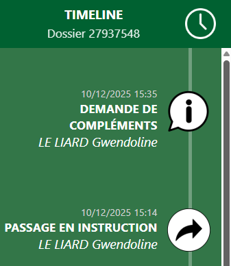
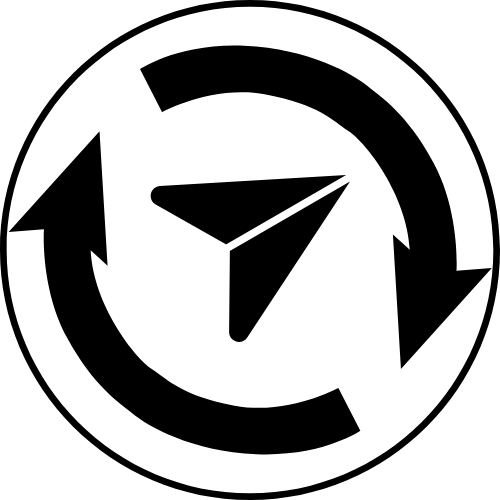
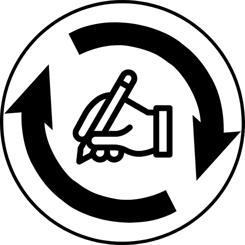
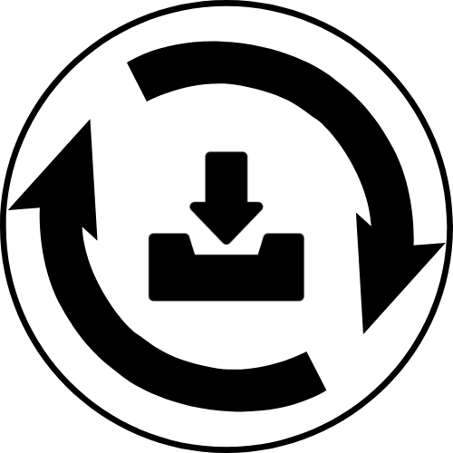
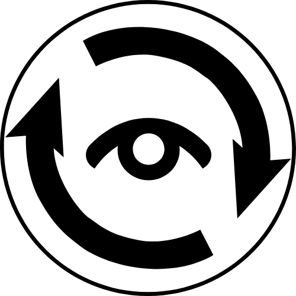
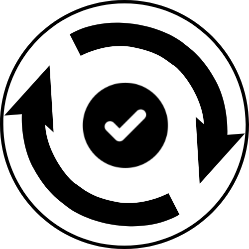
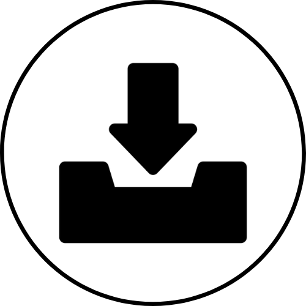
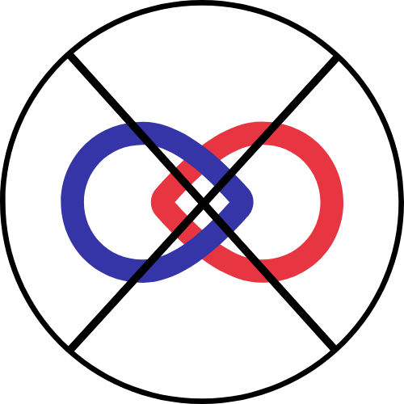

# Timeline

## Timeline minimaliste

En haut de la page d'un dossier en cours d'instruction, on retrouve une timeline horizontale en cinq étapes, qui permet de voir en un coup d'oeil l'avancement de l'instruction du dossier.

---

<figure style="text-align: center;">
  
  <figcaption><em>Figure 1 — Timeline d'un dossier</em></figcaption>
</figure>

---
- **1. Reception**  
    *Le dossier est en boîte de reception ou en pré-instruction*

- **2. Instruction**  
    *Le dossier est en cours d'instruction, l'acte n'a pas encore été transmis pour signature.*

- **3. Signature**  
    *L'acte est en attente de signature*

- **4. Envoi**  
    *L'acte signé est en attente d'envoi au pétitionnaire*

- **5. Publication**  
    *L'acte a été envoyé au pétitionnaire, il est en attente de publication au RAA*

---

## Timeline détaillée

  <figure style="margin: 0; text-align: center; flex: 0 0 auto;">
    
    <figcaption><em>Figure 2 — Barre latérale : Timeline</em></figcaption>
  </figure>

  

    

      Au survol de la souris, une barre latérale s’ouvre sur la gauche de l’écran.
    

    

     Cette timeline permet de visualiser rapidement <strong>l’ensemble des actions effectuées sur le dossier</strong>.
    

    

     Les actions sont affichées verticalement, de la plus récente en haut à la plus ancienne en bas.
    

    

     La partie gauche présente l’action réalisée, la date ainsi que l’acteur·rice. La partie droite affiche un pictogramme associé.
    

  

---

### Signification des pictogrammes de la timeline

| Icône | Action | Icône | Action |
|:-----:|--------|:-----:|--------|
|  | Dossier classé comme *Accepté* |  | Acte envoyé au pétitionnaire |
|  | Acte signé |  | Changement de la personne chargée d'envoyer l'acte signé |
|  | Changement de la personne chargée de faire l'intermédiaire pour la signature de l'acte |  | Changement de la personne chargée de publier l'acte au RAA |
|  | Changement de la personne chargée de réceptionner le dossier |  | Changement de la personne chargée de faire la relecture qualité |
|  | Changement de valideur·euse |  | Dossier classé comme *Non soumis à autorisations* |
|  | Demande de compléments envoyée au pétitionnaire |  | Transmis pour signature, (Re)passage en (pré)instruction, Envoyé pour relecture qualité |
|  | Acte ou avis envoyé pour validation |  | Changement de groupe instructeur |
|  | Instructeur·rice ajouté·e au dossier |  | Instructeur·rice retiré·e du dossier |
|  | Acte publié au RAA |  | Dossier reçu |
|  | Dossier classé comme *Refusé* |  | Relecture qualité faite |
|  | Dossier validé |  | Dossier supprimé de Démarche Numérique |

