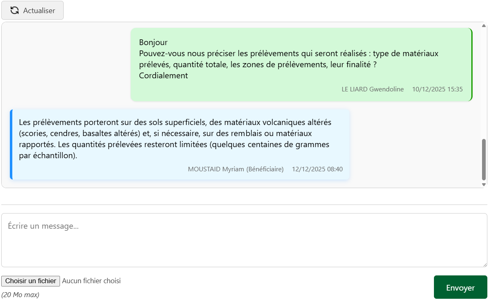

# La messagerie

---

<figure style="text-align: center;">
  
  <figcaption><em>Figure 1 — Interface « Messagerie » </em></figcaption>
</figure>

---

## Contextes d’utilisation

L’onglet Messagerie est disponible dans deux contextes distincts :

- **Pour les dossiers** : échanges entre le **pétitionnaire** et les **instructeur·rices**
- **Pour les avis** : échanges entre le **demandeur** et les **expert·es** sollicité.e.s

---

## Lecture des messages

L’interface adopte une présentation de type « conversation », facilitant la lecture :

- 🟩 **À droite (en vert)** : messages envoyés par **l’utilisateur connecté** ou des membres de son équipe
- 🟦 **À gauche (en bleu)** : messages envoyés par votre **interlocuteur.rice**

---

## Pièces jointes

Il est possible de joindre des **pièces jointes** à chaque message.

- Taille maximale par fichier : **20 Mo**
- Les pièces jointes envoyées sont automatiquement enregistrées :
  - dans le dossier **Annexes** du **dossier** ;
  - ou dans le dossier **Annexes** de l’**avis** concerné.

Pour plus de détails sur l’organisation du stockage, consulter la page  [Stockage physique](stockage.md#structure-interne-dun-dossier)

---

## Spécificités des échanges avec le pétitionnaire

### Anonymisation des échanges

- En interne, les instructeur·rices savent **qui envoie chaque message**.
- **Côté pétitionnaire**, les messages sont envoyés de manière **anonyme**, sous le libellé générique **« autorisations »**.

Cela garantit une communication claire pour le pétitionnaire, sans exposition des identités internes.

---

### Bouton Actualiser

Pour la messagerie liée aux **dossiers**, un bouton **Actualiser** est disponible en haut de l’interface.

Ce bouton permet de synchroniser la messagerie de l’application avec celle de **Démarche Numérique**. Cela permet de récupérer les éventuels nouveaux messages ou pièces jointes déposés par le pétitionnaire depuis la dernière synchronisation. 

Pour plus d'informations sur cette synchronisation, consultez la page [Réception](../onglets/reception.md#synchornisation-des-donnees).

---
