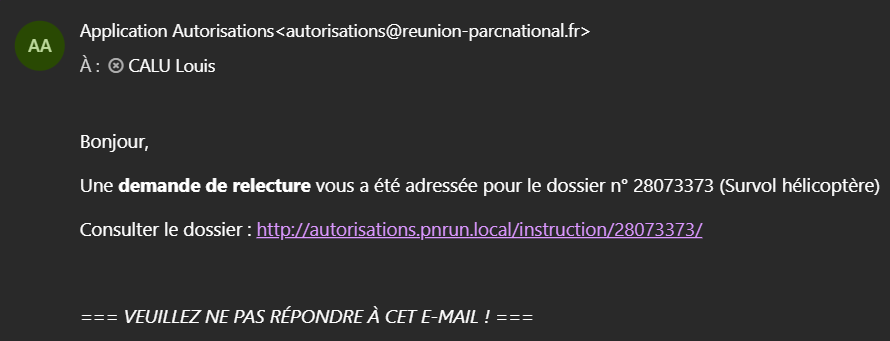

!!! info "Information"
    Page en cours de rédaction

# Les notifications

## Sur l'application

| Icône | Lieu de présence | Signification
|:-----:|--------|--------|
|  | Dans les tableaux, à gauche du nom du dossier ou de la demande d'avis | Nombre de messages non lus. Valable pour un dossier ou une demande d'avis |
|  | Dans la barre de navigation | Elle indique le nombre de dossiers ou d’avis pour lesquels une action est requise de votre part |
|  | À gauche des tableaux, en face d'une ligne | Il y a des messages non lus sur un dossier archivé |
|  | À gauche des tableaux, en face d'une ligne | Vous avez une action à réaliser sur un avis ou un dossier en cours d'instruction |

---

## Par mail

Afin de fluidifier l’instruction des dossiers, certaines actions déclenchent l’envoi automatique de **notifications par courriel**.

Ces messages permettent notamment :

- d’informer les utilisateurs lorsqu’une **action est attendue de leur part** ;
- de suivre l’avancement du dossier sans se connecter à l’application.

Les notifications sont envoyées depuis l’adresse : **autorisations@reunion-parcnational.fr** sous le nom d’expéditeur : **« Application Autorisations »**.

---

<figure style="text-align: center;">
  
  <figcaption><em>Figure 1 — Exemple d'un courrier de notification </em></figcaption>
</figure>

---

### Les différents cas de figures qui déclenchent une notification par courrier :

| Objectif de la notification | Action qui déclenche l'envoi | Destinataire
|:-----:|--------|--------|
| xxxxx | xxx | xxxxx |
| xxxxx | xxx | xxxxx |
| xxxxx | xxx | xxxxx |
| xxxxx | xxx | xxxxx |
| xxxxx | xxx | xxxxx |
| xxxxx | xxx | xxxxx |

Changement d'étape
Nouvelle demande d'avis (lié à un dossier ou générique)
Nouveau message sur la demande d'avis
L'expert rend son avis
L'expert dépose son avis signé
L'expert remplace son avis signé
Demande de relecture
Ajouter un instructeur (hors boite de reception)
Retirer un instructeur du dossier 
Changer la personne chargée de valider l'acte ou l'avis
Changer la personne chargée de faire la relecture qualité
Changer la personne chargée de faire l'intermédiaire pour la signature
Changer la personne chargée d'envoyer l'acte signé au pétitionnaire
Changer la personne chargée de publier l'acte au RAA
Modification du formulaire par le pétitionnaire suite à une demande de compléments
Nouveau(x) message(s) du pétitionnaire
Nouveau(x) dossier(s) déposés par le(s) pétitionnaire(s)
