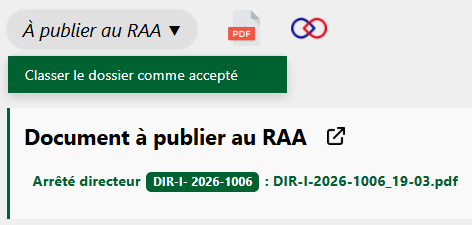

Dans le cas où le Parc autorise une demande d'autoriation, un acte d'acceptation est envoyé au demandeur (comme expliqué ici : [Envoyer l'acte d'acceptation](envoyer-acte.md#envoyer-lacte-dacceptation)). puis publié au RAA.

Une fois ces deux étapes effectuées, il ne reste plus qu'à archiver le dossier comme accepté :

---

<figure style="text-align: center;">
  
  <figcaption><em>Figure 1 — Classer le dossier comme accepté</em></figcaption>
</figure>