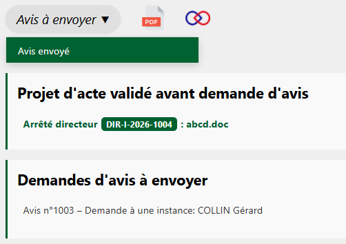
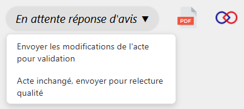

## Demande d'avis envoyée

Si l’instructeur·rice a fait valider une demande d’avis avant son envoi (voir la page [Valider le modèle de demande d'avis](valider-avis-et-acte.md)), il ou elle doit, si ce n’est pas déjà fait, procéder à l’envoi de cette demande d’avis validée.

Une fois la demande envoyée, l’instructeur·rice peut cliquer sur **« Avis envoyé »**.

---

<figure style="text-align: center;">
  
  <figcaption><em>Figure 1 — Confirmer l'envoi de la demande d'avis</em></figcaption>
</figure>

## Réponse reçue

Après un certain temps, vous recevez la réponse de l’expert·e. Deux cas de figure se présentent pour la suite de l’instruction :

- La réponse impacte le projet d’acte et vous jugez que les modifications apportées au projet d’acte doivent repasser par une étape de validation.

- La réponse n’impacte pas (ou peu) le projet d’acte : celui-ci n’a alors pas besoin de repasser en validation. **Dans ce cas, vous n’êtes pas obligé·e d’attendre la réponse de l’expert·e pour poursuivre l’instruction.**

---

<figure style="text-align: center;">
  
  <figcaption><em>Figure 2 — L'avis reçu impacte-t-il le projet d'acte ?</em></figcaption>
</figure>

