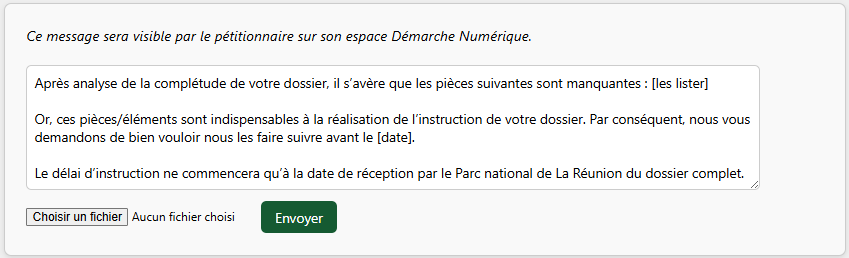

Si le dossier du demandeur est incomplet, vous pouvez lui **demander des compléments**.

Cette option est disponible uniquement pour les dossiers dont l’étape est « En pré-instruction » ou « En instruction ».

Si le dossier se trouve à un stade plus avancé, il est nécessaire de le repasser à l’étape « En instruction » avant de pouvoir effectuer une demande de compléments.

---

<figure style="text-align: center;">
  
  <figcaption><em>Figure 1 — Demander des compléments</em></figcaption>
</figure>

Lorsque vous effectuez **une demande de compléments**, vous devez préciser au demandeur les informations ou documents manquants.

Après avoir cliqué sur « Demander des compléments », une fenêtre s’ouvre.
C’est dans cette fenêtre que vous devez détailler les éléments manquants, **en complétant le modèle de message proposé par défaut**.

Vous pouvez également, si nécessaire, joindre une pièce jointe **(inférieure à 20 Mo)**.

---

<figure style="text-align: center;">
  
  <figcaption><em>Figure 2 — Formulaire demande de compléments</em></figcaption>
</figure>

Lorsque vous cliquez sur « Envoyer », **le demandeur reçoit un courriel de notification.**
Il peut alors consulter votre demande de compléments depuis son espace Démarche Numérique.

Vous serez à votre tour notifié·e lorsque le demandeur effectuera des modifications sur sa demande.

---