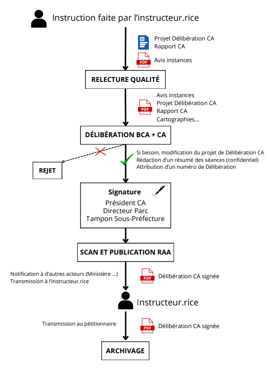

# Le déroulement de l'instruction

---

<figure style="text-align: center;">
  
  <figcaption><em>Figure 1 — Le déroulement de l'instruction </em></figcaption>
</figure>

---

Ce logigramme décrit **les différentes étapes de l'instruction** d'un dossier.

L'application respecte cet enchaînement d'étapes. À chaque étape, **une personne est systématiquement chargée de faire avancer l’instruction**, en la faisant passer à l’étape suivante. Voir la page [Les rôles](../prerequis/habilitations.md#les-roles) pour plus de détails.

---

## Le cas particulier des délibérations du Conseil d'Administration

Un acte délivré par le parc peut prendre différente forme :

- Un avis simple ( Signature Parc)
- Un avis conforme ( Signature Parc)
- Un arrêté du directeur ( Signature Parc)
- Une délibération du CA ( Signature Parc + CA + Sous Préfecture du Tampon)

Voici un aperçu détaillé des différentes étapes d’instruction d’un dossier nécessitant une délibération du conseil d’administration (CA) :

<figure style="text-align: center;">
  
  <figcaption><em>Figure 2 — Les délibérations du CA</em></figcaption>
</figure>

---
