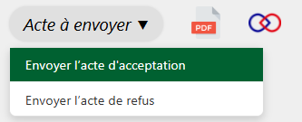
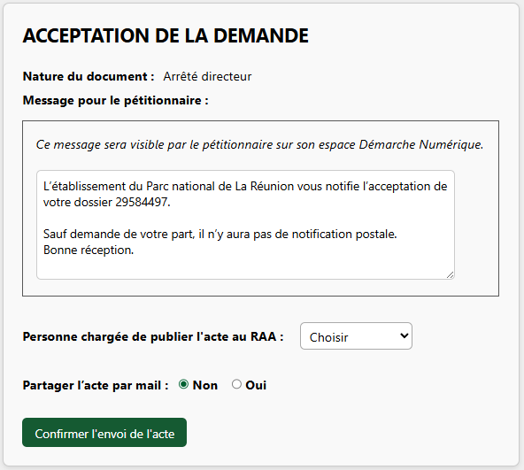
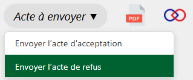
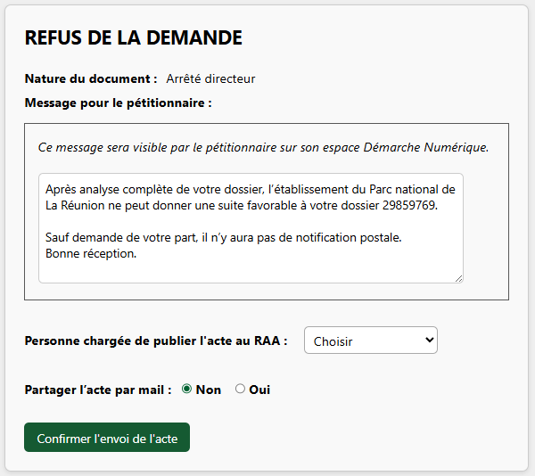

## Envoyer l'acte d'acceptation

Dans le cas d'une réponse favorable du Parc suite à une demande d'autorisation, un acte d'acceptation est délivré. 

---

<figure style="text-align: center;">
  
  <figcaption><em>Figure 1 — Envoyer l'acte d'acceptation</em></figcaption>
</figure>

Après avoir cliqué sur « Envoyer l'acte d'acceptation », la fenêtre ci-dessous s'ouvre.

Vous pouvez, si vous le souhaitez, compléter le message prérempli dans l'encadré. Ce message sera visible par le demandeur sur son espace Démarche Numérique lors de la réception de son acte.

Vous devez également désigner la personne chargée de publier l’acte au RAA après son envoi.

Enfin vous avez la possibilité de partager cet acte par mail à d'autres contacts (Voir la page [Partager l'acte par mail](partager_acte_par_mail.md) pour plus de détails)

---

<figure style="text-align: center;">
  
  <figcaption><em>Figure 2 — Formulaire : Envoyer l'acte d'acceptation</em></figcaption>
</figure>

### Envoyer des annexes

Si vous souhaitez transmettre des annexes au demandeur, vous pouvez :

- ajouter les liens [France Transfert](https://francetransfert.numerique.gouv.fr/upload) dans le message prérempli. **(Préconisé)**
- transmettre les annexes peu volumineuses dans la messagerie

---

## Envoyer l'acte de refus

Dans le cas d'une réponse défavorable du Parc suite à une demande d'autorisation, un acte de refus est délivré. 

---

<figure style="text-align: center;">
  
  <figcaption><em>Figure 3 — Envoyer l'acte de refus</em></figcaption>
</figure>

Après avoir cliqué sur « Envoyer l'acte de refus », la fenêtre ci-dessous s'ouvre.

Vous pouvez, si vous le souhaitez, compléter le message prérempli dans l'encadré. Ce message sera visible par le demandeur sur son espace Démarche Numérique lors de la réception de son acte. 

Vous devez également désigner la personne chargée de publier l’acte au RAA après son envoi.

Enfin vous avez la possibilité de partager cet acte par mail à d'autres contacts (Voir la page [Partager l'acte par mail](partager_acte_par_mail.md) pour plus de détails)

---

<figure style="text-align: center;">
  
  <figcaption><em>Figure 4 — Formulaire : Envoyer l'acte de refus</em></figcaption>
</figure>

!!! info "Information"
    Si vous souhaitez apporter des modifications aux messages préremplis par défaut, contactez le support.
