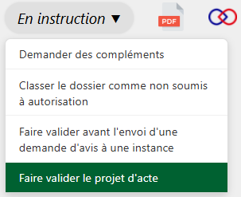
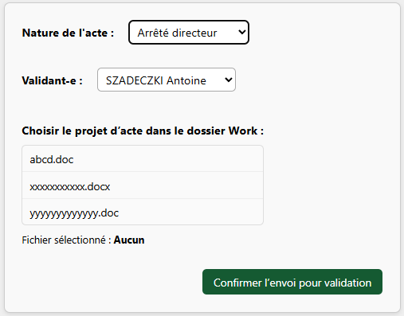

---

<figure style="text-align: center;">
  
  <figcaption><em>Figure 1 — Faire valider un projet d'acte</em></figcaption>
</figure>

Une fois votre projet d’acte rédigé, vous pouvez l’envoyer pour validation.
**La numérotation de l’acte n’intervient qu’après validation, lors de l’étape de relecture qualité.**

---

<figure style="text-align: center;">
  
  <figcaption><em>Figure 2 — Formulaire « Faire valider un projet d'acte »</em></figcaption>
</figure>

Vous devez sélectionner la personne en charge de la validation de votre projet d’acte.
Vous devez également choisir le projet d’acte, qui doit être présent dans le dossier `Work`.

