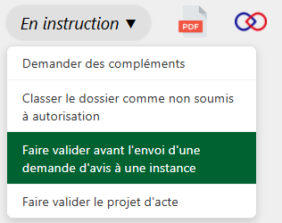
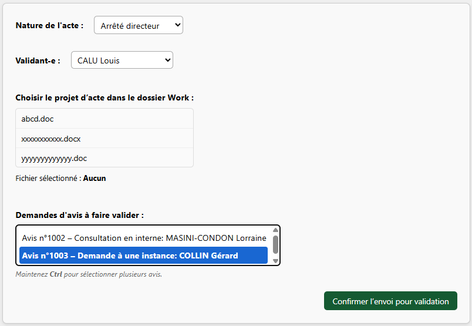

---

<figure style="text-align: center;">
  
  <figcaption><em>Figure 1 — Faire valider une demande d'avis</em></figcaption>
</figure>

Dans certains services, les demandes d’avis adressées à des instances peuvent nécessiter une validation préalable avant leur envoi.
Par la même occasion, vous pouvez en profiter pour faire valider le projet d'acte en cours. 

---

<figure style="text-align: center;">
  
  <figcaption><em>Figure 2 — Formulaire « Faire valider une demande d'avis »</em></figcaption>
</figure>

Comme pour les autres étapes de validation, vous devez sélectionner le projet d’acte, qui doit être situé dans le dossier `/Work`.
Il vous faut également sélectionner la demande d'avis que vous souhaitez faire valider avant envoi.

!!! warning "Attention"
    Pour que la demande d’avis apparaisse dans ce menu déroulant, elle doit être enregistrée au statut **« Brouillon »**.
    Pour plus d’informations, consultez [la page Consultation](../dossier/consultation/nouvelle-demande-avis.md#le-statut-brouillon).  
