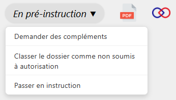

L’étape de pré-instruction permet aux instructeur·rices de vérifier si le dossier :

- est bien soumis à autorisation du Parc national de La Réunion.

- est complet.

Si ces conditions sont remplies, le dossier peut alors être passé en instruction.

---

<figure style="text-align: center;">
  
  <figcaption><em>Figure 1 — Passer en instruction</em></figcaption>
</figure>

Lors du passage en instruction, **le demandeur reçoit un accusé de passage en instruction par mail**, l’informant que l’instruction de sa demande a débuté.
