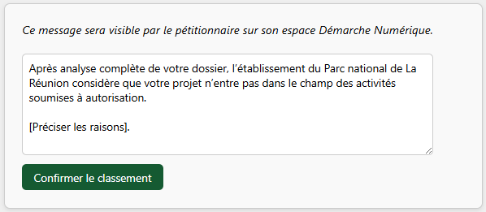

Certaines demandes peuvent ne pas être soumises à autorisation du Parc national de La Réunion.
Dans ce cas, il faut archiver le dossier comme « non soumis à autorisation ».

---

<figure style="text-align: center;">
  
  <figcaption><em>Figure 1 — Classer comme « non soumis à autorisation »</em></figcaption>
</figure>

Si vous cliquer sur `Classer comme « non soumis à autorisation »`, une fenêtre comme ci-dessous apparaitra :

<figure style="text-align: center;">
  
  <figcaption><em>Figure 2 — Formulaire : Classer comme « non soumis à autorisation »</em></figcaption>
</figure>  

**Vous devez préciser au demandeur la raison** pour laquelle sa demande n'est pas soumise à autorisation.
Le demandeur sera alerté par mail et verra votre message sur son espace Démarche Numérique.