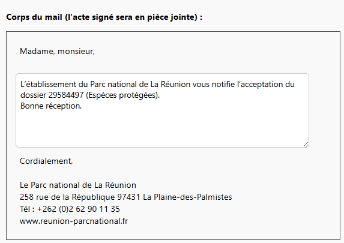

Lorsque vous êtes sur le point d'envoyer un acte au pétitionnaire (voir la page [Envoyer l'acte](envoyer-acte.md)), vous pouvez décider de partager cet acte à d'autres contacts.

En cliquant sur « Partager l'acte par mail : Oui », deux sections apparaissent en dessous :

<figure style="text-align: center;">
  
  <figcaption><em>Figure 1 — Partager l'acte par mail</em></figcaption>
</figure>

---

## Choisir les destinataires

À l’aide de la barre de recherche, vous pouvez retrouver les contacts internes ou externes avec lesquels vous souhaitez partager l’acte par courriel.

---

<figure style="text-align: center;">
  
  <figcaption><em>Figure 2 — Choisir les destinataires</em></figcaption>
</figure>

Lorsque vous cliquez sur un contact, celui-ci apparaît dans une pastille verte située en dessous.
**Ces pastilles correspondent à votre liste de destinataires.**

Vous pouvez à tout moment **supprimer un destinataire en cliquant sur la petite croix** présente sur la pastille.

### Si le contact n'est pas encore enregistré dans l'application

En tapant l'email du contact, vous n'avez aucune proposition dans les résultats de recherche : votre contact n'existe pas encore pour l'application.
Pour l'ajouter, cliquez sur le `+` vert à droite.

---

<figure style="text-align: center;">
  
  <figcaption><em>Figure 3 — Contact non existant</em></figcaption>
</figure>

En cliquant sur le bouton `+` vert, un formulaire s’ouvre et vous invite à renseigner les informations du nouveau contact :

- son nom
- son prénom ;
- le type de contact (Autre, Instance, Demandeur intermédiaire, Bénéficiaire) ;
- sa raison sociale, le cas échéant.

---

<figure style="text-align: center;">
  
  <figcaption><em>Figure 4 — Ajouter un nouveau contact</em></figcaption>
</figure>

!!! info "Information"
    Lors d’un prochain envoi d’acte par courriel, ce contact sera automatiquement reconnu dans l’application et proposé dans la barre de recherche.

---

## Le corps du mail

Dans le corps du courriel, on distingue l’en-tête et la signature, affichés sur fond gris et non modifiables, ainsi que le corps du message, prérempli sur fond blanc, qui peut être modifié.

Le document signé transmis au demandeur est automatiquement joint en pièce jointe à ce courriel.

!!! info "Information"
    Si vous souhaitez modifier l'entête, la signature ou même le corps de mail généré par défaut, contactez le support.

---

<figure style="text-align: center;">
  
  <figcaption><em>Figure 5 — Le corps du mail</em></figcaption>
</figure>

Une fois le mail envoyé, vous pouvez le visualiser directement depuis l'application (voir la page [Les envois de mail](../dossier/formulaire/pannel-droite.md#les-envois-de-mails))

