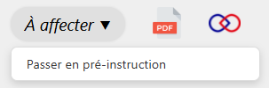

Les dossiers présents dans l’onglet Réception, au statut « À affecter », **doivent être attribués à un·e instructeur·rice avant de pouvoir être passés en pré-instruction.**

---

<figure style="text-align: center;">
  
  <figcaption><em>Figure 1 — Passer en pré-instruction</em></figcaption>
</figure>

Si vous tentez de passer un dossier en pré-instruction sans avoir affecté d’instructeur·rice, le message d’erreur suivant s’affichera :
*« Vous devez assigner un instructeur au dossier pour pouvoir le passer en pré-instruction. »*

Une fois le dossier passé en pré-instruction, les instructeur·rices associé·es reçoivent une notification par courriel.

**Le demandeur, quant à lui, ne reçoit pas de notification à cette étape**. Il sera informé lors du passage du dossier en instruction.

