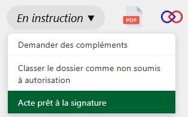
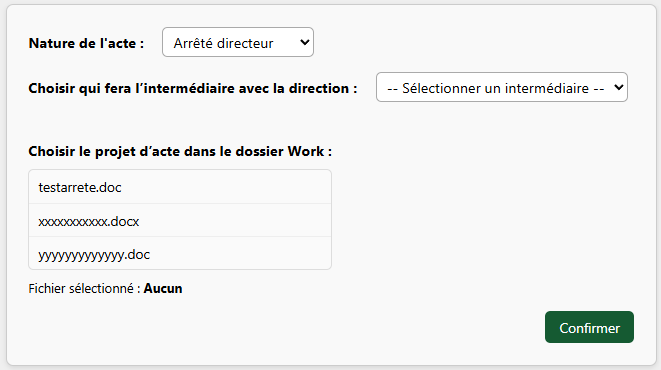
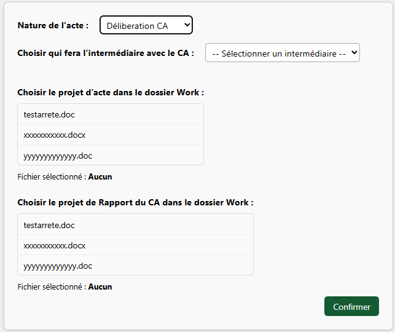

Certains services, comme le Service de préservation des patrimoines naturels (SPPN), n’ont pas besoin de passer par les étapes de validation et de relecture qualité dans leur processus d’instruction.

Ils peuvent donc **passer directement de l’étape « En instruction » à l’étape « En attente de signature ».**

---

<figure style="text-align: center;">
  
  <figcaption><em>Figure 1 — Acte prêt à la signature</em></figcaption>
</figure>

L'instructeur·rice doit sélectionner la personne qui par la suite sera chargée de faire signer l'acte.
Il·elle doit également renseigner le projet d’acte, qui doit être présent dans le dossier `Work`.

---

<figure style="text-align: center;">
  
  <figcaption><em>Figure 2 — Formulaire : Acte prêt à la signature </em></figcaption>
</figure>

Pour le cas des délibarations du CA, il faut également renseigner le projet de rapport du CA, qui doit aussi être présent dans le dossier `Work` :

---

<figure style="text-align: center;">
  
  <figcaption><em>Figure 3 — Formulaire : Délibération CA prête à la signature</em></figcaption>
</figure>

