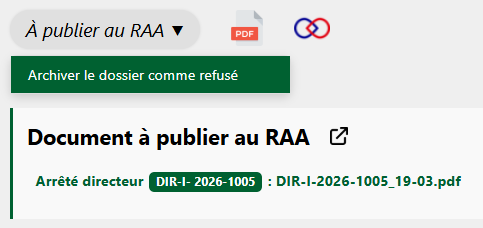

Dans certains cas, des demandes peuvent être refusées par le Parc national de La Réunion.

Le processus est le même que pour un acte d'acceptation, sauf qu'ici le Parc délivre un acte de refus (comme expliqué ici : [Envoyer l'acte de refus](envoyer-acte.md#envoyer-lacte-de-refus)). 

Une fois cet acte de refus transmis au pétitionnaire et publié au RAA, il ne reste plus qu'à l'archiver :

---

<figure style="text-align: center;">
  
  <figcaption><em>Figure 1 — Archiver le dossier comme refusé</em></figcaption>
</figure>