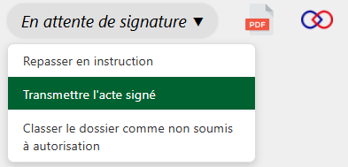
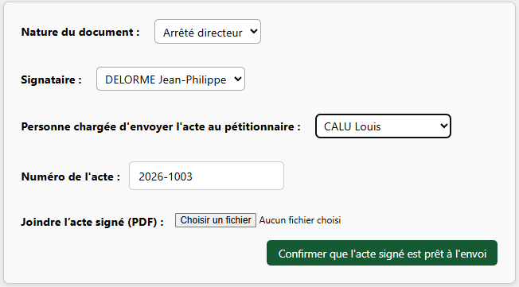

Une fois l’acte signé et récupéré au format PDF par la personne en charge de faire l'intermédiaire avec le·la signataire, celui-ci doit être déposé dans l’application.

---

<figure style="text-align: center;">
  
  <figcaption><em>Figure 1 — Transmettre l'acte signé</em></figcaption>
</figure>

Il faut alors renseigner :

- le·la signataire de l'acte
- la personne qui par la suite, sera chargée d'envoyer l'acte au demandeur
- l'acte signé au format PDF

---

<figure style="text-align: center;">
  
  <figcaption><em>Figure 2 — Formulaire : Transmettre l'acte signé</em></figcaption>
</figure>

