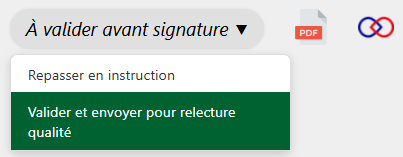
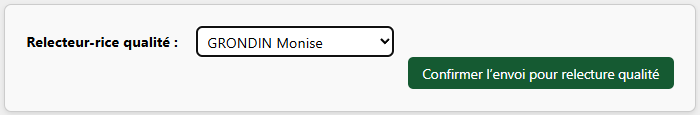

Si l’instructeur·rice souhaite faire valider un projet d'acte (voir la page [Faire valider un projet d'acte](faire-valider-acte.md)), la personne en charge de la validation devra valider ce dernier.

---

<figure style="text-align: center;">
  
  <figcaption><em>Figure 1 — Valider et envoyer pour relecture qualité</em></figcaption>
</figure>

Si vous constatez des erreurs ou des modifications à apporter, deux options s’offrent à vous :

- **Repasser le dossier à l’étape « En instruction »**, en précisant à l’instructeur·rice les modifications à effectuer.

- Si les modifications sont mineures, vous pouvez **modifier directement le projet d’acte situé dans le dossier `/Work`**, puis en informer l’instructeur·rice.

Si tout est en ordre, vous pouvez alors envoyer le projet d’acte en relecture qualité :

---

<figure style="text-align: center;">
  
  <figcaption><em>Figure 2 — Choisir qui fera la relecture qualité</em></figcaption>
</figure>

!!! info "Information"
    C'est à l'étape de « Relecture qualité » que le projet d'acte sera numéroté.
