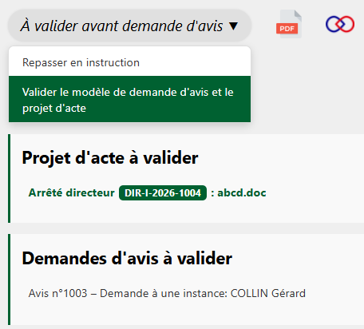
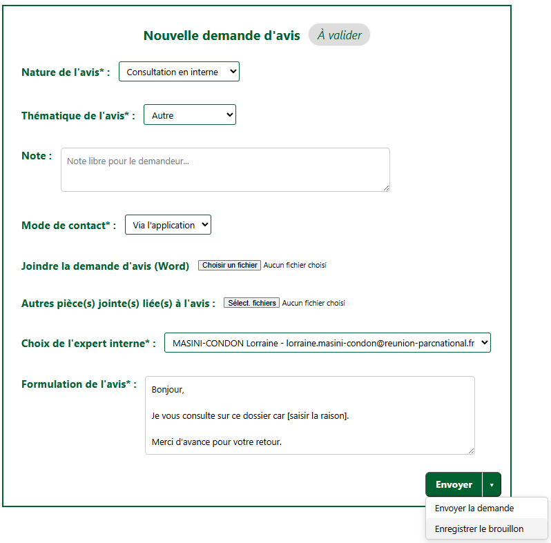

Si l’instructeur·rice souhaite faire valider une demande d’avis avant son envoi (voir la page [Faire valider une demande d'avis](faire-valider-avis.md)), la personne en charge de la validation devra valider à la fois la demande d’avis et le projet d’acte.

---

<figure style="text-align: center;">
  
  <figcaption><em>Figure 1 — Valider un projet d'acte et une demande d'avis</em></figcaption>
</figure>

La demande d’avis à valider est au statut « Brouillon ».
En cliquant sur cette demande, vous pouvez consulter le brouillon et, si nécessaire, le compléter :

---

<figure style="text-align: center;">
  
  <figcaption><em>Figure 2 — Compléter une demande d'avis au statut Brouillon</em></figcaption>
</figure>

!!! warning "Attention"
    Pour enregistrer vos éventuelles modifications, pensez à cliquer sur « Enregistrer le brouillon ». Si vous cliquez sur « Envoyer », la demande d’avis sera transmise à l’expert·e.
