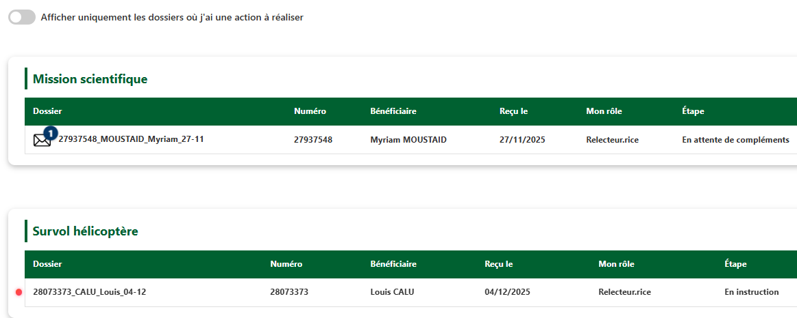

!!! info "Information"
    Page en cours de rédaction

# Onglet « Mes dossiers »

---

<figure style="text-align: center;">
  
  <figcaption><em>Figure 1 — Interface « Mes dossiers » </em></figcaption>
</figure>

---

L’application propose **un découpage par démarche**, affichant uniquement **les dossiers pour lesquels vous êtes concernés**.

Il s’agit des dossiers pour lesquels j’interviens en tant que valideur·se, instructeur·rice, relecteur·rice, signataire, intermédiaire pour la signature, publieur·euse RAA, envoyeur·euse d’acte ou encore réceptionneur·euse.

**Le bouton switch** permet d’afficher uniquement les dossiers pour lesquels j’ai une action à effectuer, identifiables avec une pastille bleu ou rouge (voir la page [Notifications](../dossier/notifications.md)).

**Le bouton Actualiser** affiche la date et l’heure de la dernière synchronisation effectuée et permet également d’en déclencher une nouvelle (voir l’onglet Actualisation de la page Réception).

