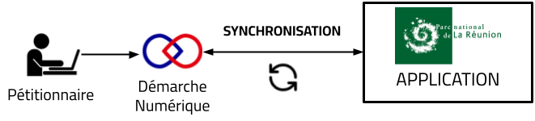

# Onglet « Réception »

## Tableau de réception

L’onglet Réception permet de visualiser l'ensemble des dossiers déposés par les pétitionnaires et **dont la pré-instruction n'a pas encore débutée**.
Une ligne correspond à un dossier. 

Un clic sur une ligne du tableau permet d’ouvrir le dossier correspondant. Les dossiers sont affichés **du plus ancien en haut au plus récent en bas**.

Pour les personnes qui appartiennent aux groupes *"Réception SAADD"* ou *"Réception SPPN"* (voir la page [Hablitations](../prerequis/habilitations.md#les-roles)), vous pouvez avoir des pastilles de notification :

- une pastille rouge numérotée sur le bouton "Reception" de la barre de navigation, indiquant le nombre de dossiers que vous devez affecter et passer en pré-instruction.
- des pastilles rouges à gauche des dossiers que vous devez affecter et passer en pré-instruction.

Pour plus de détails sur le fonctionnement des notifications, consulter la page [Notifications](../dossier/notifications.md).

---

## Synchronisation des données

L’application nécessite une **synchronisation régulière des données** avec **Démarche Numérique** afin de garantir la cohérence et l’actualité des informations telles que les données des formulaires et des messageries.

<figure style="text-align: center;">
  
  <figcaption><em>Figure 1 — La synchronisation des données </em></figcaption>
</figure>

---

### Déclenchement de la synchronisation

La synchronisation peut être lancée de plusieurs manières.

> **Synchronisation automatique**

Elle est déclenchée automatiquement :

- **tous les jours à 5h00 et à 12h00** ;
- **lorsqu’un utilisateur se connecte à l’application**, si la dernière synchronisation date de **plus de 2 heures**.

Dans ce cas, la synchronisation se lance **en tâche de fond**. Vous pouvez utiliser l'application même si une synchronisation est en cours.

> **Synchronisation manuelle**

Il est également possible de **déclencher manuellement** la synchronisation en cliquant sur le bouton dédié.

<figure style="text-align: center;">
  
  <figcaption><em>Figure 2 — Synchronisation en cours </em></figcaption>
</figure>

Lorsqu’une synchronisation est en cours, le bouton est **grisé pour l’ensemble des utilisateurs** (voir la *Figure 2* ci-dessus), afin d’éviter le lancement de plusieurs synchronisations simultanées. La synchronisation **rebalaie l’intégralité des dossiers**, ellepeut durer **plusieurs minutes**, selon le volume de données.

---

### État de la synchronisation

À chaque synchronisation :

- la **date et l’heure de la dernière synchronisation réussie** sont affichées à droite du bouton ;
- une **pastille verte** indique que la dernière synchronisation s’est déroulée avec succès.

La date de la dernière synchronisation réussie correspond à la **dernière date à laquelle l’application est pleinement à jour**.

<figure style="text-align: center;">
  
  <figcaption><em>Figure 3 — Bouton de synchronisation </em></figcaption>
</figure>

---

En cas d’erreur :

- une **pastille rouge** apparaît à droite du bouton avec le message d’erreur
- la **date de la dernière synchronisation réussie reste visible**.

En cas d’erreur, vous devez en **informer le support**.

---

### Synchronisations ciblées

En complément de la synchronisation générale, des synchronisations plus **ciblées et rapides** peuvent être réalisées :

- à l’échelle d’un **type de dossier** (voir page xxx) ;
- à l’échelle d’un **dossier spécifique** (voir page xxx) ;
- uniquement pour la **messagerie d’un dossier** (voir page xxx).

Ces synchronisations ciblées permettent de mettre à jour rapidement des éléments précis sans relancer une synchronisation globale.

---