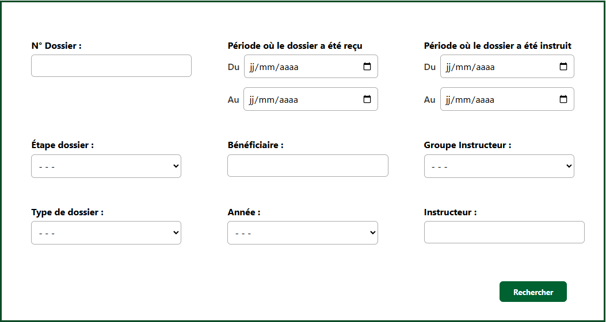
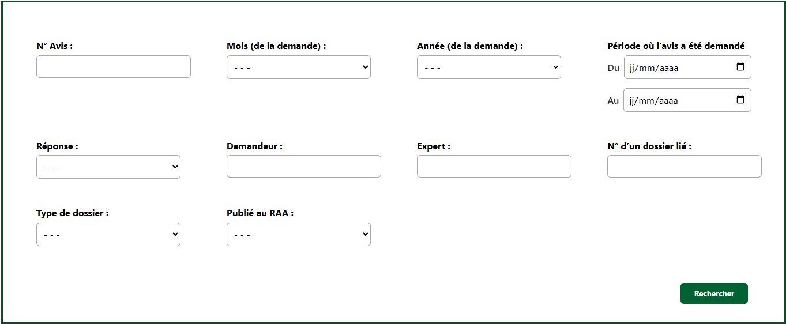
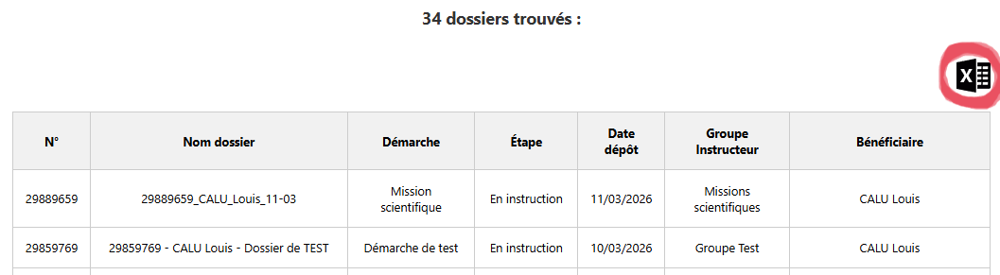

# Onglet « Requêtes »

Cette page vous permet de trouver rapidement des dossiers ou des avis grâce à de la recherche filtrée.

---

## Retrouver mon dossier

<figure style="text-align: center;">
  
  <figcaption><em>Figure 1 — Dossiers :  La recherche filtrée </em></figcaption>
</figure>

- **N° Dossier :** permet de rechercher directement un dossier à partir de son numéro.
- **Période où le dossier a été reçu** filtre les dossiers selon leur date de réception dans l’application.
- **Période où le dossier a été instruit** permet d’afficher les dossiers qui ont été traités sur une période donnée.
- **Étape dossier :** permet de filtrer les dossiers selon leur étape actuelle dans le processus d’instruction.
- **Bénéficiaire :** recherche les dossiers associés à un bénéficiaire particulier.
- **Groupe Instructeur :** affiche uniquement les dossiers attribués à un groupe instructeur spécifique.
- **Type de dossier :** filtre les dossiers selon leur type.
- **Année :** permet de limiter la recherche aux dossiers reçu sur une année en particulier.
- **Instructeur :** permet de retrouver les dossiers suivis par un instructeur spécifique.

---

## Retrouver mon avis

<figure style="text-align: center;">
  
  <figcaption><em>Figure 2 — Avis : La recherche filtrée </em></figcaption>
</figure>

- **N° Avis :** permet de retrouver un avis précis à partir de son numéro.
- **Mois (de la demande) :** filtre les avis selon le mois où la demande d’avis a été effectuée.
- **Année (de la demande) :** limite la recherche aux avis demandés sur une année spécifique.
- **Période où l’avis a été demandé** permet de filtrer les avis en fonction de leur date de demande.
- **Réponse :** permet de filtrer les avis selon leur réponse *(favorable, favorable sous réserve, défavorable, en attente)*.
- **Demandeur :** recherche les avis associés à un demandeur particulier.
- **Expert :** permet de retrouver les demandes d'avis faites à un expert spécifique.
- **N° d’un dossier lié :** permet de retrouver les avis associés à un dossier précis.
- **Type de dossier :** filtre les avis selon le type de dossier auquel ils sont rattachés.
- **Publié au RAA :** permet d’afficher uniquement les avis publiés ou non au Recueil des Actes Administratifs (RAA).

---

## Export EXCEL

<figure style="text-align: center;">
  
  <figcaption><em>Figure 3 — Exporter le fichier excel </em></figcaption>
</figure>

Une fois votre recherche effectuée, vous pouvez exporter les résultats sous forme de tableau Excel.

Pour cela, cliquez sur l’icône Excel située en haut à droite de la page.
Le fichier généré contiendra l’ensemble des résultats correspondant aux filtres actuellement appliqués.

!!! info "Information"
    Si vous cliquez sur Rechercher sans sélectionner de filtres, l’ensemble des dossiers ou des avis sera affiché.

    