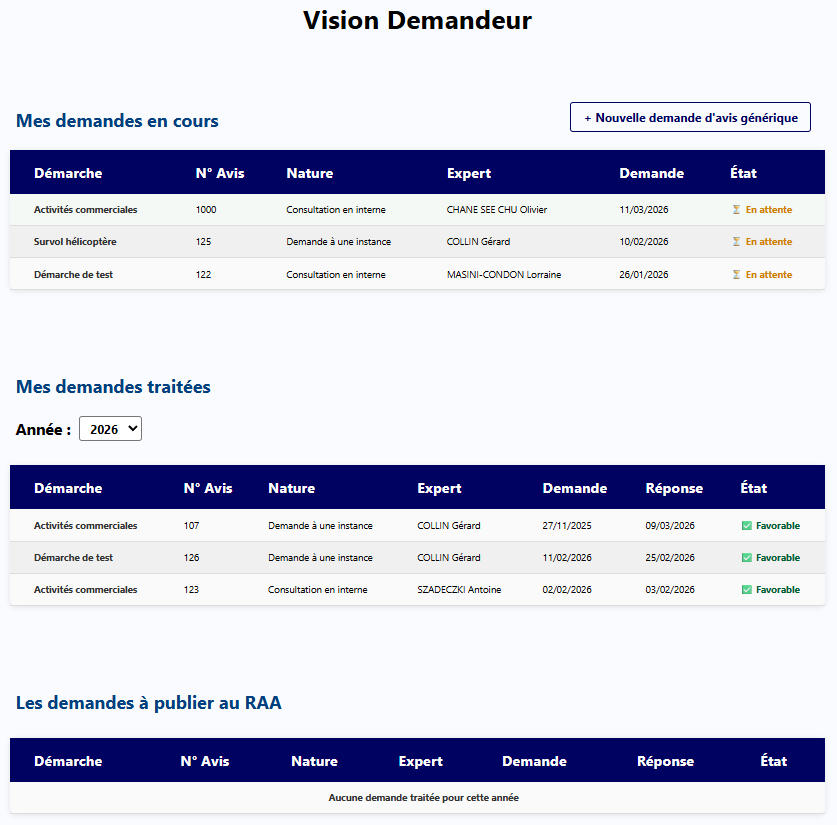
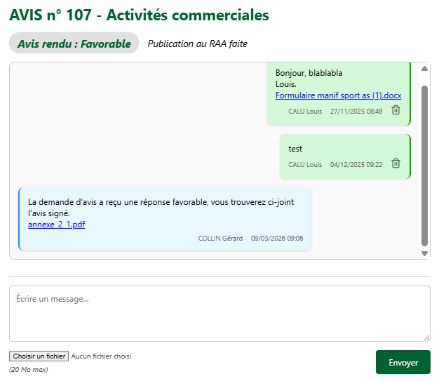
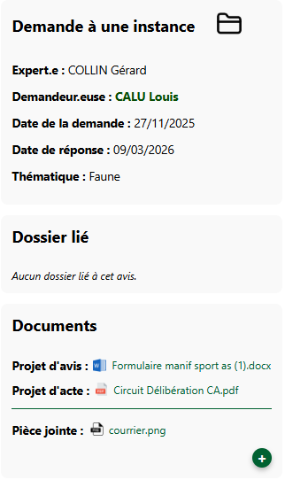

# La vision demandeur

Dans cette « Vision demandeur », **on peut retrouver jusqu'à trois sections** :

- **Mes demandes en cours :** *mes demandes d'avis en attente de réponse.*

- **Mes demandes traitées :** *mes demandes d'avis ayant reçu une réponse de l'expert-e.*

- **Les demandes à publier au RAA :** *les demandes d'avis adressées au CS que je dois publier au RAA (Recueil des Actes Administratifs). Cette partie ne vous concerne que si vous appartenez au groupe « Publication RAA Avis CS ». Voir la page [Les rôles](../prerequis/habilitations.md#les-roles) pour plus de détails.*

 

<figure style="text-align: center;">
  
  <figcaption><em>Figure 1 — La vision demandeur </em></figcaption>
</figure>

---

 

# Nouvelle demande d'avis générique

Dans cette section « Vision demandeur », vous avez la possibilité de formuler une demande d’avis générique.

Ce terme désigne une demande d’avis qui n’est pas nécessairement liée à un dossier.

*Exemple : vous souhaitez solliciter le Conseil scientifique concernant l’installation de panneaux solaires à Mafate. Cette demande n’est pas nécessairement liée à une demande d’un pétitionnaire. En revanche, si vous recevez par la suite plusieurs demandes d’autorisation portant sur ce même sujet, vous pourrez alors les relier à cet « avis générique » (Onglet Consultation > [Ajouter un avis existant](../dossier/consultation/ajouter-avis-existant.md)).*

---

Les champs à renseigner dans le formulaire de création d'une demande d'avis

🔴 : Pas concerné par ce champ   
🟠 : Champ facultatif   
🟢 : Champ obligatoire   

---

| Nom du champ | Description | En interne | À une instance |
|:-----:|--------|--------|--------|
| Nature de l'avis | *Consultation en interne* ou *Demande à une instance* | 🟢 | 🟢 |
| Type de demande | Exemple : Activités commerciales | 🟢 | 🟢 |
| Thématique de l'avis | Exemple : Chambre d'hôtes | 🟢 | 🟢 |
| Note | Note libre visible uniquement parles autres instructeurs.rices | 🟠 | 🟠 |
| Joindre la demande d'avis (Word) | Exemple : Le projet d'avis du CS | 🟠 | 🟢 |
| Joindre le projet d'acte (Word, PDF) | Exemple : Le projet d'arrêté | 🔴 | 🟠 |
| Joindre le rapport d'avis du CS (PDF) | Uniquement pour le Conseil Scientifique | 🔴 | 🟠 |
| Pièce(s) jointe(s) liée(s) à l'avis | Si nécessaire | 🟠 | 🟠 |
| Choix de l'expert externe | Pour les demandes aux instances | 🔴 | 🟢 |
| Choix de l'expert interne | Pour les consultations en interne | 🟢 | 🔴 |
| Formulation de l'avis | Message envoyé à l'expert.e avec la demande d'avis | 🟢 | 🟢 |

---

 

# Zoom sur un avis en tant que demandeur

Si, au sein de la « Vision demandeur », vous cliquez sur une demande d’avis (en cours ou terminée), vous accédez à une interface très proche de [l'onglet messagerie des dossiers](../dossier/messagerie.md) :

 

<figure style="text-align: center;">
  
  <figcaption><em>Figure 2 — La messagerie avec l'expert </em></figcaption>
</figure>

---

En haut de la page, vous pouvez voir le numéro unique de la demande d’avis ainsi que la thématique dans laquelle elle s’inscrit.

Juste en dessous, l’état de la demande est affiché (ici : favorable).
Pour certaines demandes, il est également indiqué si la publication au RAA a été effectuée (c’est le cas dans cet exemple).

Dans cette messagerie entre le demandeur et l’expert, les pièces jointes (moins de 20 Mo) échangées sont automatiquement stockées dans le dossier `Annexes` de l'avis. Pour plus de précisions, voir la page [Dossier Avis/](../dossier/stockage.md#dossier-avis).

 

    <figure style="margin: 0; text-align: center; flex: 0 0 auto;">
        
        <figcaption><em>Figure 3 — Les sections à droite</em></figcaption>
    </figure>

    

        

            À droite de cette messagerie, vous trouverez plusieurs informations relatives à la demande d’avis.
            En cliquant sur l’icône « Dossier » en haut à droite, vous pouvez copier l’emplacement physique (le chemin d’accès) de la demande d’avis.
        

        
 
            Dans la section « Dossier lié », vous trouverez des liens vers les éventuels dossiers associés à votre demande d’avis.
            Pour les demandes d’avis génériques qui ne sont pas encore liées à un dossier, cette section est vide (comme dans notre exemple).
        

        

            Enfin, dans la section « Documents », vous retrouverez les pièces jointes associées à la demande.
            Vous pouvez ajouter des pièces jointes à tout moment grâce au bouton « + ».
        

    

---
