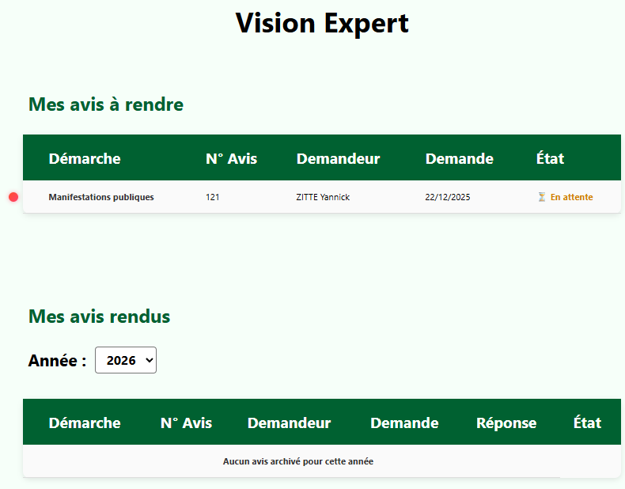
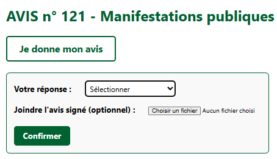

# La vision expert

Dans cette « Vision expert », on retrouve **deux sections** :

- **Mes avis à rendre :** *les demandes d’avis qui vous ont été adressées et auxquelles vous n’avez pas encore répondu.*

- **Mes avis rendu :** *les demandes d’avis qui vous ont été adressées et auxquelles vous avez déjà répondu.*

 

<figure style="text-align: center;">
  
  <figcaption><em>Figure 1 — La vision expert </em></figcaption>
</figure>

---

# Zoom sur un avis en tant qu'expert

Si, au sein de la « Vision expert », vous cliquez sur une demande d’avis (en cours ou terminée), vous accédez à une interface très semblable [à celle de la « Vision demandeur » ](vision-demandeur.md#zoom-sur-un-avis-en-tant-que-demandeur).

Le petit plus : vous avez désormais la possibilité, en tant qu’expert·e, de **rendre un avis** :

 

<figure style="text-align: center;">
  
  <figcaption><em>Figure 2 — Rendre un avis </em></figcaption>
</figure>

---

Votre réponse peut être : **Favorable**, **Favorable sous réserve** ou **Défavorable**.

Vous avez également la possibilité de joindre un document signé pour appuyer votre réponse.
Cette option est principalement utilisée pour les demandes adressées aux instances.
