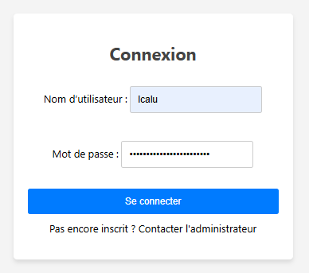

# Authentification

L’authentification utilise votre **compte du domaine PNRUN**.

Cela signifie que votre **nom d’utilisateur** et votre votre **mot de passe** sont les mêmes que ceux utilisés pour votre session Windows.

<!--  -->

<!-- !!! info "Page de connexion"

     -->
---

<figure style="text-align: center;">
  
  <figcaption><em>Figure 1 — Page de connexion</em></figcaption>
</figure>

---

## Points importants

- Il faut disposer d’un **compte actif sur le domaine PNRUN**.
- En cas de changement de mot de passe Windows, c’est automatiquement celui utilisé pour l'application.
- En cas de problème d’authentification, contactez le support.

---