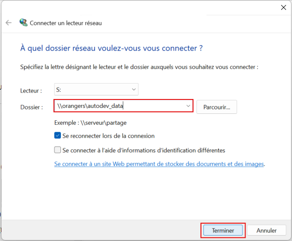

# Espace de stockage

L’application **Autorisations** s’appuie sur un **serveur NAS interne** pour stocker l’ensemble des fichiers liés aux dossiers d’autorisation.

Cet espace de stockage doit être **accessible par l’utilisateur**, faute de quoi certaines fonctionnalités de l’application ne seront pas disponibles (consultation de pièces jointes, téléchargement d’actes, manipulations cartographiques, etc.).

---

## Droits d'accès au stockage

Pour accéder au NAS, il est indispensable :

- d’être **membre du groupe Active Directory** : `autorisations`
- d’être connecté au réseau interne (filaire, Wi-Fi PNRUN ou VPN)

En cas d’accès refusé au lecteur réseau, contactez le **support informatique** afin de vérifier votre appartenance au groupe.

---

## Connexion au lecteur réseau

Le stockage est accessible via le chemin réseau suivant : ```\\orangers\autodev_data```

Il est recommandé de connecter cet emplacement comme **lecteur réseau** afin d’y accéder facilement.

---

### Étape 1 — Ouvrir la connexion de lecteur réseau

<figure style="text-align: center;">
  
  <figcaption><em>Figure 1 — « Connecter un lecteur réseau »</em></figcaption>
</figure>

---

### Étape 2 — Renseigner le chemin du stockage

Dans le champ « Dossier », renseignez : ```\\orangers\autodev_data```

<figure style="text-align: center;">
  
  <figcaption><em>Figure 2 — Saisie du chemin d'accès au NAS</em></figcaption>
</figure>

---

### Étape 3 — Vérifier le bon accès au NAS


<figure style="text-align: center;">
  
  <figcaption><em>Figure 3 — Racine du NAS</em></figcaption>
</figure>

---


<br><br><br><br><br><br><br><br><br><br><br><br>
La suite à mettre dans une autre page (on peut néanmoins ajouter un lien vers cette autre page ici) :

## Organisation générale du stockage

Le NAS est structuré de façon logique pour permettre un accès rapide aux dossiers.

### 1. La racine 
À la racine de ```\\orangers\autodev_data```, on retrouve un découpage par type de dossier.

```
/Activites_agricoles
/Activites_commerciales
/Aretes
/Documents_planification_urbanisme
/Manifestations_publiques
/Manifestations_sportives
/Missions_scientifiques
/PDV_et_son
/Survol_hélicoptere
/Travaux
```

On retrouve également un dossier `/Avis` qui regroupe l'ensemble des avis génériques (= les avis qui ne sont pas nécessairement liés à un dossier).

### 2. Deuxième niveau : Année de dépôt du dossier
Pour les types de dossier on retrouve ensuite un découpage par année de dépot.

Exemple pour `Suvol d'hélicoptère` :
```
Survol_hélicoptere/
│
├── 2023/
├── 2024/
├── 2025/
```

### 3. Troisième niveau : sous-type éventuel

Certaines démarches comme `Travaux` et `Missions scientifiques` peuvent encore être subdivisées. Ici, le nombre de sous dossiers correspond au nombre de formulaires.

Exemple pour `Travaux en 2025` :
```
/Travaux/2025/
│
├── Aire_adhesion
├── Non_soumis_urbanisme
├── Soumis_urbanisme
```

Exemple pour `Missions scientifiques en 2025` :
```
/Missions_scientifiques/2025/
│
├── Coeur_de_parc
├── Especes_protegees
```

### 4. Dernier niveau : Liste des dossiers

Exemple pour `Suvol d'hélicoptère en 2025` :
```
/Survol_hélicoptere/2025/
│
├── 27938012_MOUSTAID_Myriam_27-11/
├── 28073781_deal_reunion_04-12/
├── 28073373_CALU_Louis_04-12/
├── ...
```

---

## Structure interne d’un dossier

Chaque dossier possède toujours **la même organisation interne**, générée automatiquement par l’application.

Exemple :
```
/Survol_hélicoptere/2025/28073373_CALU_Louis_04-12/
│
├── Actes/
├── Annexes/
├── Avis/
├── Carto/
├── Work/
└── dossier-28073373.pdf
```

### Dossier *Actes/*
Contient **tous les actes signés** délivrés par le Parc (format PDF).

> Ce dossier est **en lecture seule** : il est alimenté exclusivement par l’application.

---

### Dossier *Annexes/*
Contient :

- les pièces jointes déposées par le pétitionnaire ;
- les PJ échangées via la messagerie.

> Ce dossier est **en lecture seule** : il est alimenté exclusivement par l’application.

---

### Dossier *Avis/*
Contient les **documents associés aux avis liés au dossier**.

Exemple :
```
/Survol_hélicoptere/2025/28073373_CALU_Louis_04-12/Avis/
│
├── calu_louis/
├── collin_gerard_27_11/
├── ...
```

Pour chaque dossier relatif à un avis on retrouvera :

- L'avis signé s'il existe.
- Un dossier `Annexes` qui contient l'ensemble des documents liés à l'avis (Rapport CS, Projet d'avis, Projet d'arrêté etc.).

> Ce dossier est **en lecture seule** : il est alimenté exclusivement par l’application.

---

### Dossier *Carto/*
Contient un **fichier unique `.geojson`**, représentant :

- la ou les géométries saisies par le pétitionnaire

> Ce dossier est **en lecture seule** : il est alimenté exclusivement par l’application.

---

### Dossier *Work/*
C'est le seul dossier **modifiable directement par les instructeurs**.
Il s’agit d’un **espace de travail personnel**, par exemple pour :

- stocker des documents  
- rédiger les projets d'avis  
- rédiger les projets d'actes

---

### Résumé PDF du dossier

À la racine du dossier se trouve un fichier automatiquement généré :

```
dossier-{NUMERO}.pdf
```

Ce document est généré automatiquement par [Démarche Numérique](https://demarche.numerique.gouv.fr/).
On y retrouve l'identité du demandeur, les dates de réception/début d'instruction du dossier, le formulaire du pétitionnaire ou encore les échanges dans la messagerie. 

---
