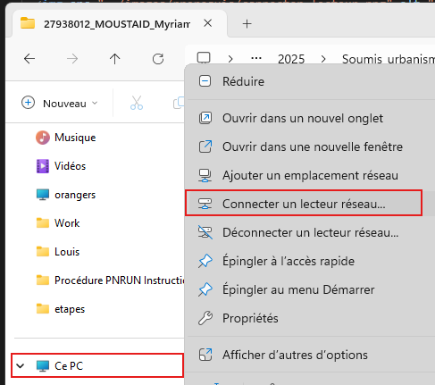
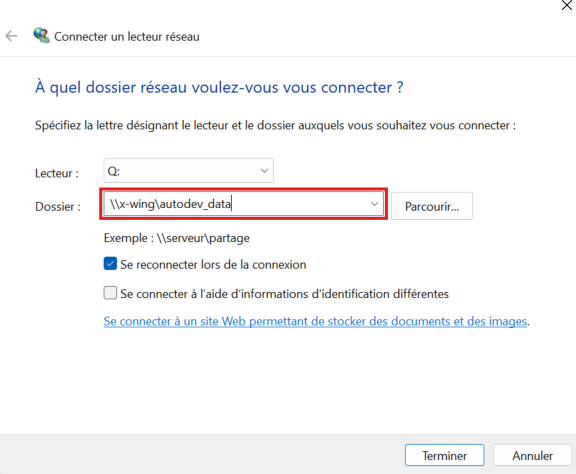
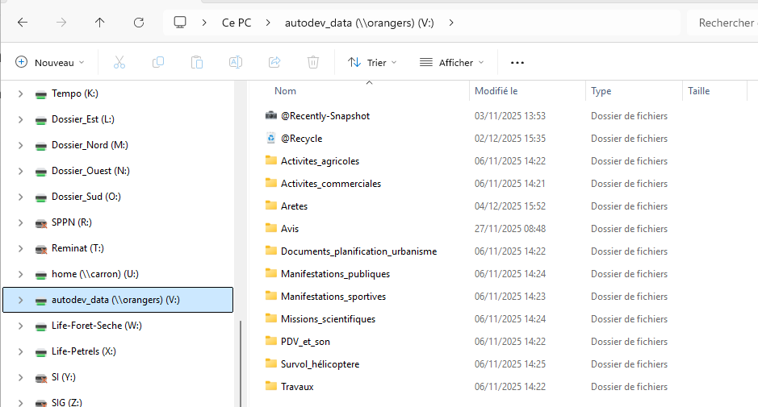

# Espace de stockage

L’application **Autorisations** s’appuie sur un **serveur NAS interne** pour stocker l’ensemble des fichiers liés aux dossiers d’autorisation.

Cet espace de stockage doit être **accessible par l’utilisateur**, faute de quoi certaines fonctionnalités de l’application ne seront pas disponibles (consultation de pièces jointes, téléchargement d’actes, manipulations cartographiques, etc.).

---

## Droits d'accès au stockage

Pour accéder au NAS, il est indispensable :

- d’être **membre du groupe Active Directory** : `autorisations`
- d’être connecté au réseau interne (filaire, Wi-Fi PNRUN ou VPN)

En cas d’accès refusé au lecteur réseau, contactez le **support informatique** afin de vérifier votre appartenance au groupe.

---

## Connexion au lecteur réseau

Le stockage est accessible via le chemin réseau suivant : ```\\x-wing\autodev_data```

Il est recommandé de connecter cet emplacement comme **lecteur réseau** afin d’y accéder facilement.

---

### Étape 1 — Ouvrir la connexion de lecteur réseau

<figure style="text-align: center;">
  
  <figcaption><em>Figure 1 — « Connecter un lecteur réseau »</em></figcaption>
</figure>

---

### Étape 2 — Renseigner le chemin du stockage

Dans le champ « Dossier », renseignez : ```\\x-wing\autodev_data```

<figure style="text-align: center;">
  
  <figcaption><em>Figure 2 — Saisie du chemin d'accès au NAS</em></figcaption>
</figure>

---

### Étape 3 — Vérifier le bon accès au NAS

<figure style="text-align: center;">
  
  <figcaption><em>Figure 3 — Racine du NAS</em></figcaption>
</figure>

Pour en savoir davantage sur la structure du stockage et l’organisation des sous-dossiers, consultez la page [Stockage physique](../dossier/stockage.md)

---