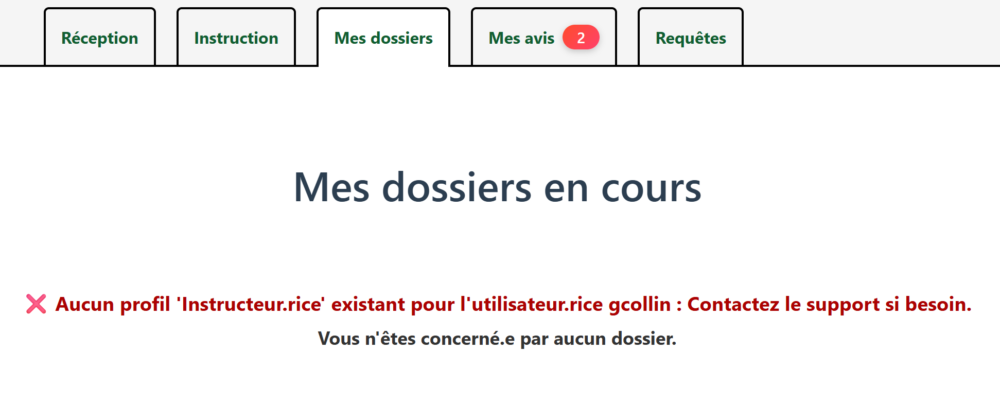

# Les habilitations

Une fois que vous êtes correctement authentifié.e sur l'application, il faudra qu'on configure votre profil et les privilèges associés.

## Profil Instructeur

Si vous jouez un rôle dans l'instruction des dossiers, il faut qu'on vous déclare un profil 'Instructeur'. Sans ce profil, des fonctionnalités vous serons masquées et vous ne serez pas en capacité de participer à l'instruction. Si vous rencontrez ce genre de message d'erreur, c'est que vous ne disposez pas de profil 'Instructeur' :

<figure style="text-align: center;">
  
  <figcaption><em>Figure 1 — « Aucun profil Instructeur »</em></figcaption>
</figure>

---

## Les rôles

Une fois votre profil Instructeur créé, il faut vous attribuer les bons privilèges. Il existe un certain nombre de rôles :

- **Envoi de l'acte SAADD / Envoi de l'acte SPPN**  
    *Personnes habilitées à envoyer l’acte final au pétitionnaire, une fois signé et validé. Le rôle est identique, mais attribué au service SAADD ou au service SPPN selon le type de dossier.*

- **Envoi pour signature SAADD / Envoi pour signature SPPN**  
    *Personnes habilitées à transmettre l’acte au signataire (Directeur, Président, etc.) pour signature officielle.*

- **Intermédiaire CA**  
    *Personne assurant le lien avec le Conseil d’Administration lorsque des dossiers nécessite une Délibération du CA.*

- **Publication RAA Avis CS**  
    *Rôle permettant de publier au RAA (Recueil des Actes Administratifs) les avis du Conseil Scientifique.*

- **Publication RAA SAADD / Publication RAA SPPN**  
    *Personnes autorisées à publier au RAA les actes signés.*

- **Réception SAADD / Réception SPPN**  
    *Personne qui réceptionne les dossiers nouvellement déposés (qui relèvent du service SAADD ou SPPN) et qui les affecte au bon.ne.s instructeur.rices.*

- **Relecteur-rice qualité SAADD / Relecteur-rice qualité SPPN**  
    *Personnes chargées de la relecture qualité des actes et avis avant transmission au signataire. Assure la conformité rédactionnelle.*

- **Signataire**  
    *Personne ayant l’autorité administrative pour signer les actes (Directeur, Directeur adjoint)*

- **Validant-e SAADD / Validant-e SPPN**  
    *Rôle permettant de valider le contenu d’un acte ou d’un avis avant la phase de signature. Vérification de la conformité juridique, de la cohérence interne du dossier de la complétude des éléments.*

---

## Les groupes instructeurs

De la même façon, si vous êtes un.e instructeur.rice, il faut vous associer aux bons groupes. Il existe un certain nombre de groupes instructeurs qui sont liés directement aux formulaires à disposition des pétitionnaires :

- *Manifestations sportives*
- *Documents de planification et d'urbanisme*
- *Activités commerciales*
- *Activités agricoles*
- *Courses arêtes*
- *Travaux (3 formulaires différents)*
- *Missions scientifiques (2 formulaires différents)*
- *Manifestations publiques*
- *Prise de vue et son*
- *Survol*
- *Secteur Ouest*
- *Secteur Est*
- *Secteur Sud*
- *Secteur Nord*

!!! info "Information"
    Si vous souhaitez être associé.e à un ou plusieurs groupes - rôles, rapprochez-vous du support.

---